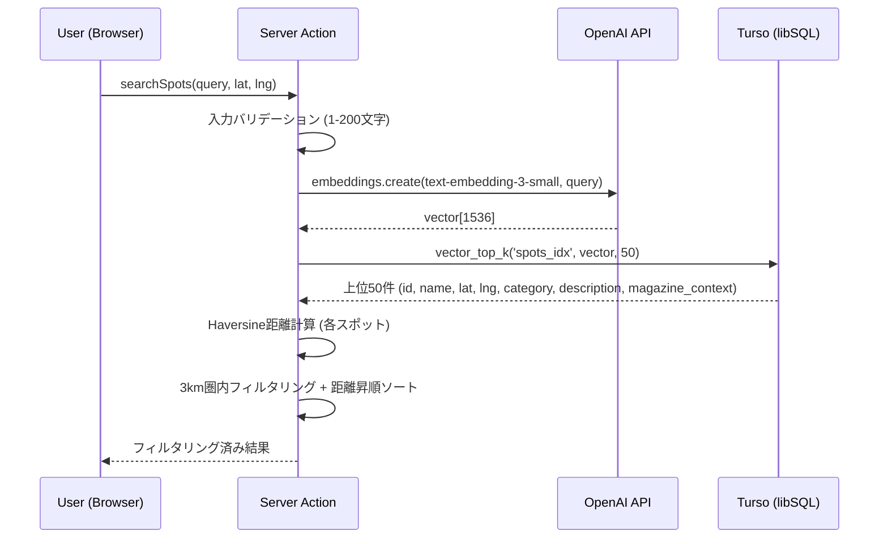

# ADR-0002: ベクトル検索アーキテクチャ (セマンティック検索 + Geo フィルタリングのハイブリッド)

| 項目 | 内容 |
|------|------|
| ステータス | Accepted |
| 日付 | 2026-02-10 |
| 決定者 | Context-Map チーム |
| 関連ADR | ADR-0001, ADR-0003 |

---

## 背景

Context-Map の検索は「自然言語テキストによるセマンティック検索」と「ユーザー現在地からの距離によるフィルタリング」の2軸を組み合わせる必要がある。Turso (SQLiteベース) にはPostGISのような地理空間関数（`ST_DWithin`等）が存在しないため、セマンティック検索と距離フィルタリングの統合方式を設計する必要がある。

### 制約条件
- Turso (libSQL) はSQLiteベースであり、PostGIS相当の地理関数を持たない
- 検索レスポンスはP95で2秒以内
- OpenAI API呼び出し (Embedding生成) が検索フローに含まれる
- MVP規模のデータ件数は100-500件

---

## オプション

### オプションA: 2段階ハイブリッド方式 (Vector First + App Layer Geo Filter) [選択案]

- **概要**: 第1段階でTursoのベクトル検索（DiskANN）によりセマンティック類似度上位50件を取得し、第2段階でアプリケーション層（Server Actions）でHaversine公式による距離計算・フィルタリングを行う
- **メリット**:
  - Tursoのネイティブベクトルインデックスを最大限活用
  - 地理計算はJavaScript (Server Actions) で完結し、DB拡張不要
  - ロジックが明確に分離され、テスタビリティが高い
  - 50件の距離計算は計算量として無視できるレベル
- **デメリット**:
  - セマンティック上位50件の中に近隣スポットが含まれない可能性（意味的に類似だが遠い場所のみがヒット）
  - 2段階処理のためレイテンシが加算される（ただし距離計算は<1ms）
- **工数**: 1-2日

### オプションB: WHERE句による事前Geoフィルタリング + ベクトル検索

- **概要**: SQLクエリでまず緯度経度の矩形範囲（Bounding Box）でフィルタリングし、その後にベクトル類似度でソート
- **メリット**:
  - 距離圏外のスポットが結果に混入しない
  - DB層で完結するため追加のアプリケーションロジック不要
- **デメリット**:
  - Tursoの `vector_top_k` テーブル値関数はWHERE句と組み合わせた場合に、インデックス効率が低下する可能性がある
  - 矩形フィルタリングは円形の距離フィルタより精度が低い
  - 狭い範囲にスポットが少ない場合、セマンティック検索の意味が薄れる
- **工数**: 2-3日

### オプションC: 全件取得 + App層でスコアリング

- **概要**: 全スポットを取得し、アプリケーション層でセマンティックスコアと距離スコアを重み付け合成してランキング
- **メリット**:
  - 最も柔軟なスコアリングロジックが実装可能
  - セマンティック類似度と距離の最適バランスを調整できる
- **デメリット**:
  - 全件のEmbedding転送による帯域・メモリ消費（500件x1536次元x4bytes = 約3MB）
  - データ増加時にスケールしない
  - ベクトルインデックスの利点を享受できない
- **工数**: 1-2日（ただしスケーラビリティ改修が将来必要）

---

## 比較

| 評価軸 | オプションA (2段階ハイブリッド) | オプションB (事前Geoフィルタ) | オプションC (全件スコアリング) |
|--------|-------------------------------|------------------------------|-------------------------------|
| 検索品質 | 高 (セマンティック優先) | 中 (範囲制約で候補減少) | 最高 (最適バランス) |
| レスポンス速度 | 高速 (<100ms for 50件計算) | 高速 | 低速 (データ増加で悪化) |
| スケーラビリティ | 高 (DiskANNインデックス活用) | 中 | 低 (全件転送) |
| 実装単純性 | 高 | 中 (クエリ最適化必要) | 高 |
| Turso互換性 | 高 (公式API準拠) | 不明 (複合クエリ制約) | 不要 |
| テスタビリティ | 高 (各段階独立テスト可能) | 中 | 高 |

---

## 決定

**オプションA (2段階ハイブリッド方式)** を選択する。

### 理由

1. **「Vibe」検索の本質に適合**: Context-Mapのコンセプトは「気分に合う場所の発見」であり、セマンティック類似度を第一優先とするアーキテクチャが製品ビジョンに合致する。距離は二次的なフィルタとして機能させることで、「意味的に最適な場所」を優先できる。

2. **Tursoの公式APIに準拠**: `vector_top_k` テーブル値関数はTursoが推奨するベクトル検索の公式パターンであり、DiskANNインデックスの性能を最大限活用できる。複合クエリの最適化問題を回避できる。

3. **明確な責務分離**: ベクトル検索（DB層）と距離計算（App層）が明確に分離され、各レイヤーの独立テストが容易。将来的に距離計算ロジックの変更（半径調整、重み付け等）がDB変更なしで対応可能。

### トレードオフ

- セマンティック上位50件の全てが遠方の場合、フィルタリング後の結果が0件になる可能性がある。この場合は「該当するスポットが見つかりませんでした」メッセージを表示する（AC-003準拠）。
- 将来的にデータ件数が増加した場合、上位50件の取得数を調整するパラメータ化が必要。

---

## 検索フロー（詳細）



### アルゴリズム擬似コード

```
function searchSpots(query, userLat, userLng):
  // Stage 1: Semantic Search (DB Layer)
  vector = openai.embed(query)  // ~200ms
  candidates = turso.vector_top_k('spots_idx', vector, 50)  // ~50ms

  // Stage 2: Geo Filtering (App Layer)
  results = candidates
    .map(spot => { ...spot, distance: haversine(userLat, userLng, spot.lat, spot.lng) })
    .filter(spot => spot.distance <= 3.0)  // 3km radius
    .sort((a, b) => a.distance - b.distance)

  return results  // <1ms for filtering/sorting 50 items
```

---

## 結果と影響

### 正の結果
- セマンティック検索とGeoフィルタリングの明確な責務分離
- DiskANNインデックスによるベクトル検索の高速化
- アプリケーション層でのフィルタリングパラメータの柔軟な調整
- 各段階の独立テスト容易性

### 負の結果
- フィルタリング後に0件となるエッジケースへの対応が必要
- 上位取得件数（50件）はチューニングパラメータとして管理が必要
- OpenAI API呼び出しがクリティカルパス上にある（可用性リスク）

### 実装ガイドライン（原則）
- ベクトル検索の上位取得件数は定数として定義し、パラメータ化する
- 距離計算ロジック（Haversine）は純粋関数として実装し、単体テスト可能にする
- OpenAI API呼び出しにはタイムアウト設定とエラーハンドリングを実装する
- 検索結果が0件の場合のUI表現を明確に定義する

---

## 参考資料

- [Turso AI & Embeddings - vector_top_k](https://docs.turso.tech/features/ai-and-embeddings) - vector_top_kの公式ドキュメント
- [DiskANN in libSQL](https://turso.tech/blog/approximate-nearest-neighbor-search-with-diskann-in-libsql) - DiskANNアルゴリズムの解説
- [OpenAI Embeddings Guide](https://platform.openai.com/docs/guides/embeddings) - Embedding生成のベストプラクティス
- [Text Embeddings with OpenAI: A Practical Guide for 2026](https://thelinuxcode.com/text-embeddings-with-openai-a-practical-engineers-guide-for-2026/) - Embedding検索の実践ガイド
