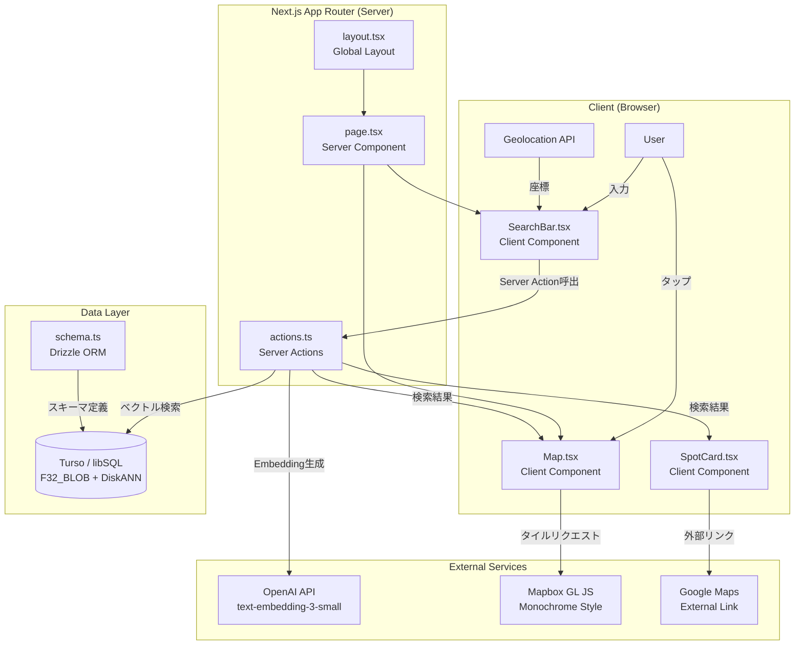
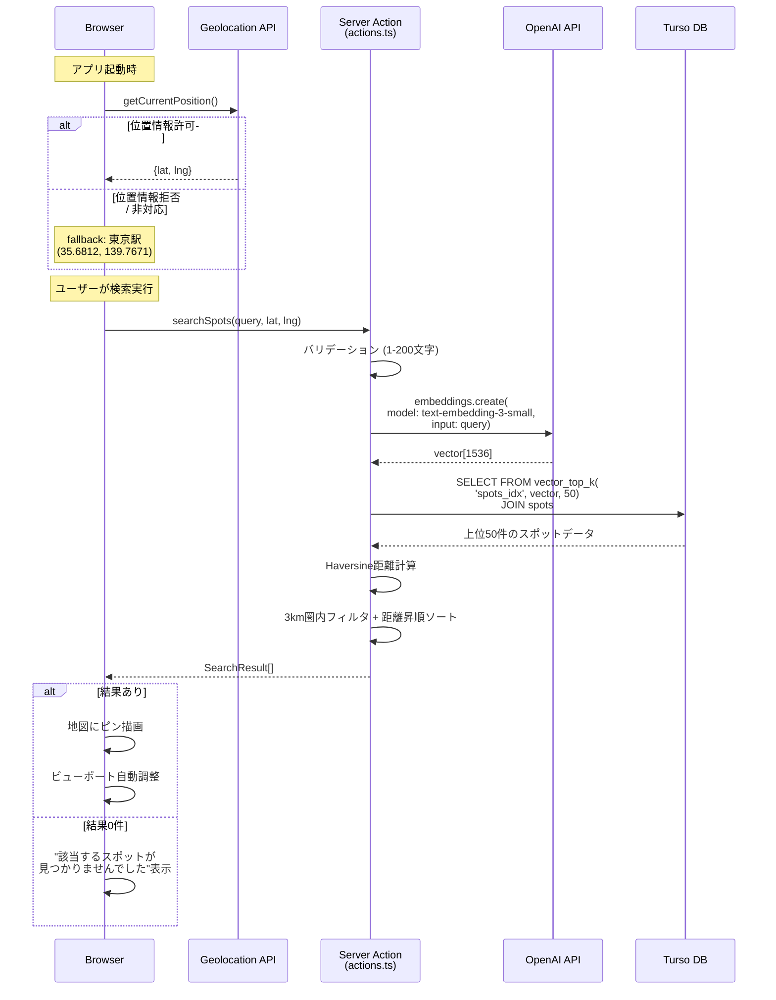
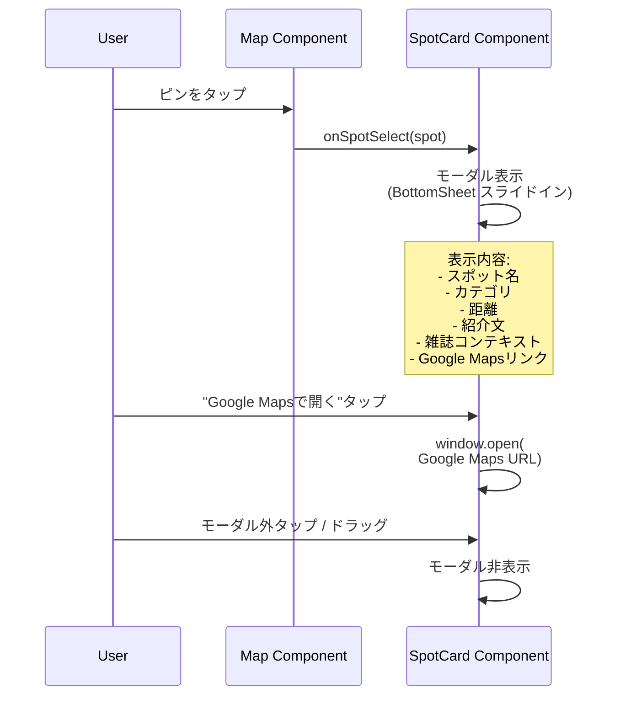
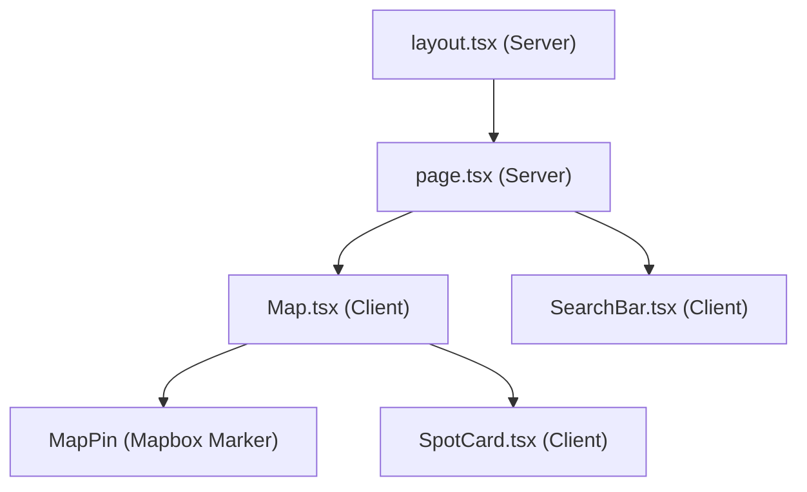

# Design Doc: Context-Map MVP

| 項目 | 内容 |
|------|------|
| ドキュメントID | DD-CTXMAP-001 |
| バージョン | 1.0 |
| 作成日 | 2026-02-10 |
| ステータス | Draft |
| 複雑度 | Medium |
| 複雑度根拠 | (1) 8つのMVP機能要件(F-001~F-008)、セマンティック検索+Geoフィルタの2段階処理、地図・モーダル・検索バーの3つのUI状態管理 (2) OpenAI API外部依存、Tursoネイティブベクトル型の制約、Geolocation API非同期処理 |

---

## 合意チェックリスト

### スコープ（変更対象）
- [x] Vibe検索（セマンティック検索）機能: Server Action + OpenAI Embedding + Tursoベクトル検索
- [x] Mapbox GL JS地図表示: 白黒モノクロームスタイルの全画面地図
- [x] スポットピン表示: 検索結果の地図上ピン描画
- [x] スポット詳細モーダル: BottomSheetスライドインUI
- [x] 位置情報取得: Geolocation API + 東京駅フォールバック
- [x] 距離フィルタリング: Haversine公式によるサーバーサイド計算
- [x] Google Maps連携: 外部リンク
- [x] Seedデータ投入: seed.tsスクリプト

### 非スコープ（変更しない）
- [x] ユーザー認証・会員機能
- [x] PWA対応（Should Haveとして将来実装）
- [x] 検索半径の動的調整
- [x] ユーザーレビュー・投稿
- [x] 管理画面（CMS）
- [x] 東京以外の地域データ
- [x] アナリティクス基盤

### 制約
- [x] Turso (SQLite) にPostGIS相当の地理関数なし -> App層でHaversine計算
- [x] 検索レスポンスP95 2秒以内
- [x] APIキーは全てサーバーサイドのみ（NEXT_PUBLIC_はMapboxトークンのみ）
- [x] モバイルファースト + デスクトップ対応
- [x] 入力バリデーション: 1-200文字

### パフォーマンス要件
- [x] 検索レスポンス: P95 2秒以内
- [x] FCP: 1.5秒以内
- [x] LCP: 2.5秒以内

### 合意の設計反映確認
- [x] 全てのスコープ項目がコンポーネント設計に反映されている
- [x] 非スコープ項目が設計に含まれていないことを確認
- [x] 制約事項が検索フローとエラーハンドリングに反映されている
- [x] パフォーマンス要件がアーキテクチャ設計に反映されている

---

## 前提ADR

| ADR | タイトル | 決定事項 |
|-----|---------|---------|
| [ADR-0001](adr/ADR-0001-technology-stack.md) | 技術スタック選定 | Next.js 15 + Turso + Mapbox GL JS + OpenAI |
| [ADR-0002](adr/ADR-0002-vector-search-architecture.md) | ベクトル検索アーキテクチャ | 2段階ハイブリッド方式 (Vector First + App Layer Geo Filter) |
| [ADR-0003](adr/ADR-0003-embedding-storage-strategy.md) | Embedding格納戦略 | F32_BLOB(1536) + DiskANN Cosineインデックス |

---

## 適用スタンダード

| スタンダード | 分類 | 内容 |
|-------------|------|------|
| TypeScript Strict Mode | `[explicit]` | idea.mdに記載 |
| Tailwind CSS Mobile First | `[explicit]` | idea.mdに記載 |
| App Router (Server Components優先) | `[explicit]` | idea.md / PRDに記載 |
| Server Actions (APIルート不使用) | `[explicit]` | idea.mdに記載 |
| Drizzle ORM (型安全DB操作) | `[explicit]` | idea.mdに記載 |
| 環境変数によるAPIキー管理 | `[explicit]` | PRDに記載 |

---

## 既存コードベース分析

### 実装ファイルパス検証

現時点でプロジェクトにソースコードは存在しない（新規プロジェクト）。以下は計画されるファイル構造である。

```
src/
  app/
    layout.tsx          [新規] グローバルレイアウト
    page.tsx            [新規] メインマップビュー (Server Component)
    actions.ts          [新規] Server Actions (検索ロジック)
  components/
    Map.tsx             [新規] Mapbox地図コンポーネント (Client Component)
    SearchBar.tsx       [新規] 検索バー (Client Component)
    SpotCard.tsx        [新規] スポット詳細モーダル (Client Component)
  db/
    index.ts            [新規] Turso接続設定
    schema.ts           [新規] Drizzleスキーマ定義
  lib/
    geo.ts              [新規] Haversine距離計算ユーティリティ
    constants.ts        [新規] 定数定義
  types/
    spot.ts             [新規] 型定義
seed.ts                 [新規] Seedスクリプト
drizzle.config.ts       [新規] Drizzle Kit設定
```

### 類似機能検索結果

新規プロジェクトのため既存の類似機能なし。新規実装として進行する。

### コード検査エビデンス

| 検査対象 | 関連性 |
|----------|--------|
| docs/idea.md | パターン参照: ディレクトリ構造、スキーマ定義、検索ロジックのサンプル |
| docs/prd.md | 要件参照: 受入基準、非機能要件、スコープ定義 |

---

## システムアーキテクチャ



---

## データフロー

### 検索フロー (メインフロー)



### スポット詳細表示フロー



---

## コンポーネント設計

### コンポーネント階層



### 各コンポーネントの責務

#### 1. `layout.tsx` (Server Component)
- **責務**: グローバルHTML構造、メタデータ、フォント設定
- **状態**: なし
- **依存**: Next.js Metadata API

#### 2. `page.tsx` (Server Component)
- **責務**: メインページのレイアウト構成、子コンポーネントの配置
- **状態**: なし
- **依存**: Map, SearchBar コンポーネント

#### 3. `Map.tsx` (Client Component - `'use client'`)
- **責務**: Mapbox GL JS地図の描画、ピンの配置、ビューポート制御
- **状態**:
  - `viewState` (lng, lat, zoom): 地図の表示状態
  - `spots` (SearchResult[]): 表示中のスポット一覧
  - `selectedSpot` (Spot | null): 選択中のスポット
- **依存**: react-map-gl (v8), Mapbox GL JS
- **Props**:
  - `initialCenter: { lat: number; lng: number }` 初期中心座標
  - `searchResults: SearchResult[]` 検索結果

#### 4. `SearchBar.tsx` (Client Component - `'use client'`)
- **責務**: 検索テキスト入力、Server Action呼び出し、ローディング状態管理
- **状態**:
  - `query` (string): 入力テキスト
  - `isSearching` (boolean): 検索中フラグ
  - `userLocation` ({lat, lng}): ユーザー位置情報
- **依存**: Server Action (searchSpots)
- **Props**:
  - `onResults: (results: SearchResult[]) => void` 結果コールバック

#### 5. `SpotCard.tsx` (Client Component - `'use client'`)
- **責務**: スポット詳細のBottomSheetモーダル表示
- **状態**:
  - `isOpen` (boolean): モーダル開閉状態
- **依存**: なし（Props driven）
- **Props**:
  - `spot: SearchResult | null` 表示するスポット
  - `onClose: () => void` 閉じるコールバック

---

## APIインターフェース設計 (Server Actions)

### `searchSpots` - Vibe検索

```typescript
// src/app/actions.ts
'use server'

interface SearchResult {
  id: number;
  name: string;
  lat: number;
  lng: number;
  category: string;
  description: string | null;
  magazineContext: string | null;
  distance: number; // km単位
}

interface SearchError {
  code: 'VALIDATION_ERROR' | 'EMBEDDING_ERROR' | 'DB_ERROR' | 'UNKNOWN_ERROR';
  message: string;
}

type SearchResponse =
  | { success: true; data: SearchResult[] }
  | { success: false; error: SearchError };

export async function searchSpots(
  query: string,
  userLat: number,
  userLng: number
): Promise<SearchResponse>;
```

**入力バリデーション**:
- `query`: 1文字以上200文字以下、空白のみ不可
- `userLat`: -90 ~ 90 の範囲
- `userLng`: -180 ~ 180 の範囲

**処理フロー**:
1. 入力バリデーション
2. OpenAI Embedding API呼び出し（タイムアウト: 5秒）
3. Turso `vector_top_k` クエリ（上位50件）
4. Haversine距離計算 + 3kmフィルタリング + 距離昇順ソート
5. SearchResponse返却

---

## データベーススキーマ

### テーブル定義

```sql
CREATE TABLE spots (
  id INTEGER PRIMARY KEY AUTOINCREMENT,
  name TEXT NOT NULL,
  lat REAL NOT NULL,
  lng REAL NOT NULL,
  category TEXT NOT NULL,
  description TEXT,
  magazine_context TEXT,
  embedding F32_BLOB(1536),
  created_at TEXT DEFAULT CURRENT_TIMESTAMP
);

CREATE INDEX spots_idx ON spots (
  libsql_vector_idx(embedding, 'metric=cosine')
);
```

### Drizzle ORM スキーマ (`src/db/schema.ts`)

```typescript
import { sqliteTable, text, integer, real } from "drizzle-orm/sqlite-core";
import { sql } from "drizzle-orm";

export const spots = sqliteTable("spots", {
  id: integer("id").primaryKey({ autoIncrement: true }),
  name: text("name").notNull(),
  lat: real("lat").notNull(),
  lng: real("lng").notNull(),
  category: text("category").notNull(),
  description: text("description"),
  magazineContext: text("magazine_context"),
  // F32_BLOB(1536) はDrizzle ORMで直接表現できないため、
  // マイグレーションSQL で CREATE TABLE を直接定義し、
  // Drizzle のクエリではRaw SQLを使用する
  embedding: text("embedding"), // プレースホルダ（実際はF32_BLOB）
  createdAt: text("created_at").default(sql`CURRENT_TIMESTAMP`),
});

export type Spot = typeof spots.$inferSelect;
export type NewSpot = typeof spots.$inferInsert;
```

### DB接続設定 (`src/db/index.ts`)

```typescript
import { drizzle } from "drizzle-orm/libsql";
import { createClient } from "@libsql/client";

const client = createClient({
  url: process.env.TURSO_DATABASE_URL!,
  authToken: process.env.TURSO_AUTH_TOKEN!,
});

export const db = drizzle(client);
```

### データ型定義 (`src/types/spot.ts`)

```typescript
export interface SpotRecord {
  id: number;
  name: string;
  lat: number;
  lng: number;
  category: string;
  description: string | null;
  magazineContext: string | null;
  createdAt: string | null;
}

export interface SearchResult extends SpotRecord {
  distance: number; // km
}

export interface UserLocation {
  lat: number;
  lng: number;
  isDefault: boolean; // true = 東京駅フォールバック
}
```

---

## データ表現決定

### Embedding ベクトルデータ

- **既存構造との重複**: なし（新規プロジェクト）
- **決定**: `F32_BLOB(1536)` ネイティブベクトル型を採用
- **根拠**: ADR-0003に記載。意味的フィット（Embedding専用型）、責務フィット（ベクトル検索カラム）、ライフサイクルフィット（スポットデータと同一ライフサイクル）の全基準を満たす

### SearchResult 型

- **既存構造との重複**: なし
- **決定**: SpotRecordを拡張し、distanceフィールドを追加する新規構造
- **根拠**: SpotRecord（DB由来）に検索時計算のdistanceを追加するため、拡張パターンが適切

---

## フィールド伝搬マップ

| フィールド | DB (Turso) | Server Action | Client Component | 状態 |
|-----------|------------|---------------|------------------|------|
| id | INTEGER | number | number | preserved |
| name | TEXT | string | string | preserved |
| lat | REAL | number | number | preserved |
| lng | REAL | number | number | preserved |
| category | TEXT | string | string | preserved |
| description | TEXT | string \| null | string \| null | preserved |
| magazine_context | TEXT | magazineContext: string \| null | magazineContext: string \| null | preserved (renamed at ORM layer) |
| embedding | F32_BLOB | (not propagated) | (not propagated) | dropped (検索時のみDB層で使用) |
| created_at | TEXT | (not propagated) | (not propagated) | dropped (UI不要) |
| distance | (computed) | number (km) | number (km) | added (Server Action層で計算) |

---

## 統合ポイントマップ

### Integration Point 1: SearchBar -> Server Action
```yaml
既存コンポーネント: SearchBar.tsx (Client Component)
統合方法: Server Action直接呼び出し (useTransition)
影響レベル: High (メインデータフロー)
テストカバレッジ: Server Actionの入力バリデーション、レスポンス型の検証
```

### Integration Point 2: Server Action -> OpenAI API
```yaml
既存コンポーネント: actions.ts (Server Action)
統合方法: OpenAI SDK (openai.embeddings.create)
影響レベル: High (検索機能のクリティカルパス)
テストカバレッジ: タイムアウト、エラーハンドリング、レスポンス型検証
```

### Integration Point 3: Server Action -> Turso DB
```yaml
既存コンポーネント: actions.ts (Server Action)
統合方法: libSQL client + Raw SQL (vector_top_k)
影響レベル: High (データ取得のクリティカルパス)
テストカバレッジ: クエリ結果の型変換、空結果の処理
```

### Integration Point 4: Map Component -> Mapbox GL JS
```yaml
既存コンポーネント: Map.tsx (Client Component)
統合方法: react-map-gl ライブラリ (declarative API)
影響レベル: High (メインUI)
テストカバレッジ: ピン描画、ビューポート調整、インタラクション
```

### Integration Point 5: SpotCard -> Google Maps
```yaml
既存コンポーネント: SpotCard.tsx (Client Component)
統合方法: 外部リンク (window.open)
影響レベル: Low (Read-Only外部遷移)
テストカバレッジ: URL生成の正確性
```

---

## 統合境界契約

### Boundary 1: Client -> Server Action (searchSpots)
```yaml
境界名: 検索リクエスト
  入力: { query: string (1-200文字), userLat: number (-90~90), userLng: number (-180~180) }
  出力 (同期): SearchResponse { success: boolean, data?: SearchResult[], error?: SearchError }
  エラー時:
    - バリデーションエラー -> { success: false, error: { code: 'VALIDATION_ERROR', message } }
    - OpenAI APIエラー -> { success: false, error: { code: 'EMBEDDING_ERROR', message } }
    - DBエラー -> { success: false, error: { code: 'DB_ERROR', message } }
```

### Boundary 2: Server Action -> OpenAI API
```yaml
境界名: Embedding生成
  入力: { model: 'text-embedding-3-small', input: string }
  出力 (非同期): { data: [{ embedding: number[] }] }
  エラー時:
    - タイムアウト (5秒) -> EMBEDDING_ERROR として上位に伝搬
    - APIエラー (429/500等) -> EMBEDDING_ERROR として上位に伝搬
```

### Boundary 3: Server Action -> Turso DB
```yaml
境界名: ベクトル検索クエリ
  入力: vector32 (1536次元float32配列), k=50
  出力 (非同期): SpotRecord[] (最大50件)
  エラー時:
    - 接続エラー -> DB_ERROR として上位に伝搬
    - クエリエラー -> DB_ERROR として上位に伝搬
```

### Boundary 4: Geolocation API -> SearchBar
```yaml
境界名: 位置情報取得
  入力: なし (ブラウザAPI)
  出力 (非同期): { lat: number, lng: number }
  エラー時:
    - 拒否/非対応 -> フォールバック { lat: 35.6812, lng: 139.7671, isDefault: true }
```

---

## 変更影響マップ

新規プロジェクトのため、既存コードへの影響はない。以下はコンポーネント間の依存関係マップである。

```yaml
変更対象: searchSpots() (Server Action)
直接影響:
  - src/app/actions.ts (新規作成)
  - src/db/index.ts (DB接続 - 新規作成)
  - src/db/schema.ts (スキーマ定義 - 新規作成)
  - src/lib/geo.ts (距離計算 - 新規作成)
間接影響:
  - src/components/SearchBar.tsx (Server Action呼び出し元)
  - src/components/Map.tsx (検索結果描画)
  - src/components/SpotCard.tsx (詳細表示)
波及なし:
  - src/app/layout.tsx (グローバルレイアウト - 検索ロジックに無関係)
  - seed.ts (データ投入スクリプト - 独立実行)
  - drizzle.config.ts (設定ファイル - ランタイムに無関係)
```

---

## インターフェース変更影響分析

新規プロジェクトのため変換は不要。以下は主要インターフェースの定義マトリクスである。

| インターフェース | 提供元 | 消費先 | データ型 | アダプタ要否 |
|-----------------|--------|--------|----------|-------------|
| searchSpots() | actions.ts | SearchBar.tsx | SearchResponse | 不要 |
| SearchResult | types/spot.ts | Map.tsx, SpotCard.tsx | SearchResult | 不要 |
| UserLocation | types/spot.ts | SearchBar.tsx | UserLocation | 不要 |
| Turso Raw SQL結果 | libSQL client | actions.ts | Row[] -> SpotRecord[] | 必要 (型変換ヘルパー) |
| Geolocation API | Browser | SearchBar.tsx | Position -> UserLocation | 必要 (変換ヘルパー) |

---

## エラーハンドリング戦略

### エラー分類と対処

| エラー種別 | 発生箇所 | 対処 | ユーザー表示 |
|-----------|---------|------|-------------|
| バリデーションエラー | Server Action入口 | 即座にエラー返却 | 「検索テキストは1~200文字で入力してください」 |
| OpenAI APIタイムアウト | Server Action | 5秒でタイムアウト、リトライなし | 「検索に失敗しました。もう一度お試しください」 |
| OpenAI APIレート制限 (429) | Server Action | エラー返却 | 「検索に失敗しました。しばらくお待ちください」 |
| Turso接続エラー | Server Action | エラー返却 | 「検索に失敗しました。もう一度お試しください」 |
| 検索結果0件 | Server Action | 空配列返却 (正常系) | 「該当するスポットが見つかりませんでした」 |
| Geolocation拒否 | Client | 東京駅フォールバック | なし（サイレントフォールバック） |
| Mapbox読み込みエラー | Client | ローディング状態維持 | 「地図の読み込みに失敗しました」 |

### エラーハンドリング方針（原則）
- Server Actionのエラーは全て `SearchResponse` 型で統一的に返却する
- ユーザーに技術的詳細（スタックトレース等）を露出しない
- 外部API呼び出しにはタイムアウトを設定する
- Geolocation失敗はサイレントフォールバックとし、ユーザー体験を中断しない

---

## 実装アプローチ

### 選択: Vertical Slice (機能単位の垂直統合)

**選択理由**: Context-Mapは「検索してスポットを見つける」という単一の主要フローを持つ。各フェーズで検索フローの端から端までを動作させることで、早期にE2E検証が可能となり、プロダクトのコアバリューを迅速にデモンストレーションできる。

### Phase 1: データ基盤 + 検索コア (E2E検証: L2)
| タスク | 成果物 | 検証レベル |
|--------|--------|-----------|
| Tursoスキーマ作成 (F32_BLOB + DiskANN) | schema.sql, schema.ts | L1: スキーマ適用確認 |
| DB接続設定 | db/index.ts | L1: 接続確認 |
| Seedスクリプト作成 | seed.ts | L2: データ投入+検索確認 |
| searchSpots Server Action | actions.ts, lib/geo.ts | L2: Embedding生成+検索+距離フィルタ |

**Phase 1 E2E検証**: seed.tsでデータ投入後、Server Actionを直接呼び出してベクトル検索結果が返ることを確認。

### Phase 2: 地図UI + 検索統合 (E2E検証: L2)
| タスク | 成果物 | 検証レベル |
|--------|--------|-----------|
| Mapbox地図表示 (モノクロームスタイル) | Map.tsx | L1: 地図描画確認 |
| 検索バーUI | SearchBar.tsx | L1: 入力UI確認 |
| 検索 -> ピン表示統合 | Map.tsx + actions.ts | L2: 検索結果がピンとして表示 |
| Geolocation + フォールバック | SearchBar.tsx | L2: 位置情報取得+フォールバック |

**Phase 2 E2E検証**: ブラウザで検索テキストを入力し、地図上にピンが表示されることを確認。

### Phase 3: スポット詳細 + 仕上げ (E2E検証: L3)
| タスク | 成果物 | 検証レベル |
|--------|--------|-----------|
| スポット詳細モーダル (BottomSheet) | SpotCard.tsx | L2: モーダル表示+情報確認 |
| Google Maps連携 | SpotCard.tsx | L1: リンク遷移確認 |
| エラーハンドリング統合 | 全コンポーネント | L2: 各エラーパターン確認 |
| モバイル対応 + レスポンシブ調整 | CSS調整 | L3: 全デバイスE2E |

**Phase 3 E2E検証**: モバイルブラウザで、検索 -> ピン表示 -> ピンタップ -> 詳細モーダル -> Google Maps遷移の完全フローを確認。

### 検証レベル定義
- **L1**: 単体動作確認（コンポーネント/関数が単独で動作する）
- **L2**: 統合確認（複数コンポーネントが連携して動作する）
- **L3**: E2E確認（ユーザーフロー全体が端から端まで動作する）

---

## 受入基準

### AC-001: Vibe検索（セマンティック検索）

**Happy Path:**
- 検索バーに「静かな場所で本を読みたい」と入力し検索を実行すると、意味的に関連するスポット（カフェ、図書館等）が結果として返却される
- 検索結果は最大50件のセマンティック候補から3km圏内にフィルタリングされたものである
- 検索完了までの時間が2秒以内である（P95）

**Unhappy Path:**
- 空文字列で検索を実行するとバリデーションエラーが表示される
- 201文字以上のテキストで検索を実行するとバリデーションエラーが表示される
- OpenAI APIがエラーを返した場合、「検索に失敗しました」メッセージが表示される

**Edge Case:**
- 1文字のみ（例: 「夜」）で検索しても正常に結果が返却される
- 英語テキスト（例: "quiet coffee shop"）でも検索が動作する

### AC-002: 地図表示

**Happy Path:**
- ページアクセス時に全画面の白黒モノクローム地図が表示される
- 地図はドラッグ・ピンチでパン・ズーム操作が可能である
- iOS Safari、Android Chromeで正常にレンダリングされる

**Unhappy Path:**
- Mapboxの読み込みに失敗した場合、エラー状態が表示される

### AC-003: スポットピン表示

**Happy Path:**
- 検索結果が1件以上ある場合、各スポット位置にアクセントカラーのピンが表示される
- 地図のビューポートが検索結果のピン群を含む範囲に自動調整される

**Unhappy Path:**
- 検索結果が0件の場合、「該当するスポットが見つかりませんでした」メッセージが表示される

### AC-004: スポット詳細モーダル

**Happy Path:**
- ピンをタップすると画面下部からスライドインするシートUIが表示される
- スポット名、カテゴリ、距離、紹介文、雑誌コンテキスト、Google Mapsリンクが表示される
- モーダル背景にブラーエフェクトが適用される

**Edge Case:**
- descriptionがnullの場合、紹介文欄が非表示または適切なプレースホルダが表示される
- magazineContextがnullの場合、雑誌コンテキスト欄が非表示または適切なプレースホルダが表示される
- モーダル外タップまたはドラッグハンドルで閉じることができる

### AC-005: 位置情報取得

**Happy Path:**
- 位置情報を許可すると、現在地が地図の中心に設定される
- 検索時に現在地の座標が使用される

**Unhappy Path:**
- 位置情報を拒否した場合、東京駅（35.6812, 139.7671）がデフォルトとして使用される
- Geolocation APIが非対応の場合、同様に東京駅がデフォルトとなる
- いずれの場合も検索は正常に動作する

### AC-006: 距離フィルタリング

**Happy Path:**
- Haversine公式により各スポットとの距離が正確に計算される
- デフォルト3km圏内のスポットのみが結果に含まれる
- 結果は距離の昇順でソートされる

**Edge Case:**
- 3km圏内にスポットが0件の場合、空配列が返却される

### AC-007: Google Maps連携

**Happy Path:**
- 「Google Mapsで開く」ボタンをタップするとGoogle Mapsが新しいタブで開かれる
- スポットの座標がGoogle Mapsに正しく渡される

### AC-008: Seedデータ投入

**Happy Path:**
- seed.tsスクリプトを実行すると東京エリアのスポットデータがTursoに投入される
- 各スポットにname, lat, lng, category, description, magazine_context, embedding (float32Array) が含まれる
- 投入後にVibe検索が正常に動作する

**Unhappy Path:**
- DB接続エラー時に適切なエラーメッセージが表示され、部分投入が発生しない（トランザクション管理）

---

## 非機能要件

| カテゴリ | 要件 | 目標値 | 検証方法 |
|----------|------|--------|----------|
| パフォーマンス | 検索レスポンス | P95 2秒以内 | サーバーサイドログ |
| パフォーマンス | FCP | 1.5秒以内 | Lighthouse |
| パフォーマンス | LCP | 2.5秒以内 | Lighthouse |
| セキュリティ | APIキー保護 | サーバーサイドのみ | 環境変数レビュー |
| セキュリティ | 入力サニタイズ | 200文字制限 | バリデーションテスト |
| アクセシビリティ | キーボード操作 | 検索バーフォーカス、モーダル閉じ | 手動テスト |
| アクセシビリティ | スクリーンリーダー | ARIAラベル付与 | Lighthouse |

---

## 環境変数

| 変数名 | 用途 | スコープ |
|--------|------|---------|
| `TURSO_DATABASE_URL` | Turso DB接続URL | Server only |
| `TURSO_AUTH_TOKEN` | Turso認証トークン | Server only |
| `OPENAI_API_KEY` | OpenAI APIキー | Server only |
| `NEXT_PUBLIC_MAPBOX_TOKEN` | Mapboxアクセストークン | Client (公開可) |

---

## 定数定義 (`src/lib/constants.ts`)

```typescript
// 検索パラメータ
export const VECTOR_TOP_K = 50;           // ベクトル検索の上位取得件数
export const DEFAULT_RADIUS_KM = 3.0;     // デフォルト検索半径 (km)
export const MAX_QUERY_LENGTH = 200;      // 最大検索文字数
export const MIN_QUERY_LENGTH = 1;        // 最小検索文字数

// Geolocation フォールバック (東京駅)
export const DEFAULT_LAT = 35.6812;
export const DEFAULT_LNG = 139.7671;
export const DEFAULT_ZOOM = 14;

// OpenAI
export const EMBEDDING_MODEL = 'text-embedding-3-small';
export const EMBEDDING_DIMENSIONS = 1536;
export const EMBEDDING_TIMEOUT_MS = 5000;

// Mapbox
export const MAP_STYLE = 'mapbox://styles/mapbox/light-v11'; // モノクローム/ホワイト
export const PIN_COLOR = '#1a1a6e'; // 群青色系アクセントカラー
```

---

## 参考資料

- [Turso AI & Embeddings Documentation](https://docs.turso.tech/features/ai-and-embeddings) - Tursoのベクトル検索機能公式ドキュメント
- [Turso Native Vector Search](https://turso.tech/blog/turso-brings-native-vector-search-to-sqlite) - ネイティブベクトル検索のアナウンス
- [DiskANN in libSQL](https://turso.tech/blog/approximate-nearest-neighbor-search-with-diskann-in-libsql) - DiskANNインデックスの技術解説
- [Space Complexity of Vector Indexes](https://turso.tech/blog/the-space-complexity-of-vector-indexes-in-libsql) - ベクトルインデックスのストレージ分析
- [Next.js 15 App Router](https://nextjs.org/docs/app) - Next.js App Router公式ドキュメント
- [Next.js Server Actions](https://nextjs.org/docs/app/getting-started/updating-data) - Server Actions公式ガイド
- [Next.js Advanced Patterns for 2026](https://medium.com/@beenakumawat002/next-js-app-router-advanced-patterns-for-2026-server-actions-ppr-streaming-edge-first-b76b1b3dcac7) - 2026年のNext.js先進パターン
- [Drizzle ORM + Turso](https://orm.drizzle.team/docs/tutorials/drizzle-with-turso) - Drizzle ORMとTursoの統合ガイド
- [Turso + Drizzle Documentation](https://docs.turso.tech/sdk/ts/orm/drizzle) - Turso公式のDrizzle統合ドキュメント
- [react-map-gl](https://visgl.github.io/react-map-gl/) - React用Mapboxラッパーライブラリ (v8)
- [Mapbox GL JS + React](https://docs.mapbox.com/help/tutorials/use-mapbox-gl-js-with-react/) - Mapbox公式Reactチュートリアル
- [OpenAI Embeddings Guide](https://platform.openai.com/docs/guides/embeddings) - OpenAI Embedding公式ドキュメント
- [OpenAI text-embedding-3-small](https://platform.openai.com/docs/models/text-embedding-3-small) - Embeddingモデル仕様
- [Text Embeddings with OpenAI: A Practical Guide for 2026](https://thelinuxcode.com/text-embeddings-with-openai-a-practical-engineers-guide-for-2026/) - Embedding検索の実践ガイド
- [How to Generate & Store OpenAI Vector Embeddings with Turso](https://turso.tech/blog/how-to-generate-and-store-openai-vector-embeddings-with-turso) - OpenAI + Turso統合ガイド

---

## 変更履歴

| バージョン | 日付 | 変更内容 | 変更者 |
|------------|------|----------|--------|
| 1.0 | 2026-02-10 | 初版作成 | Technical Designer |
