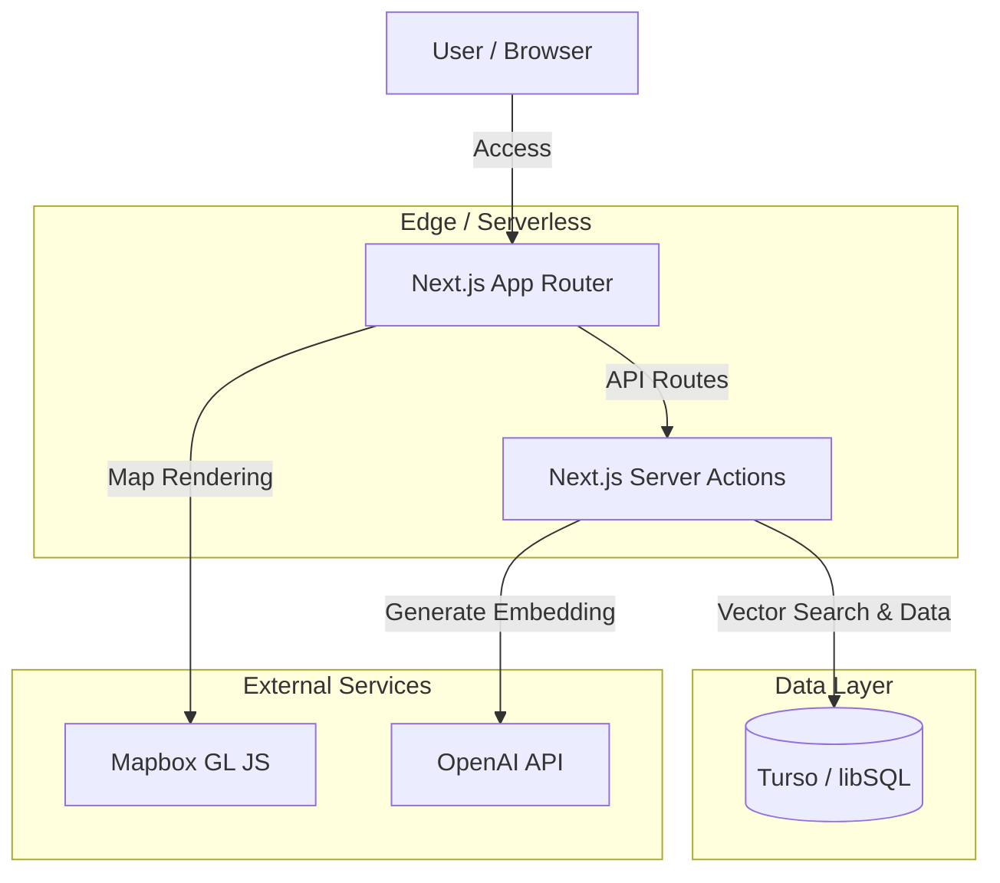
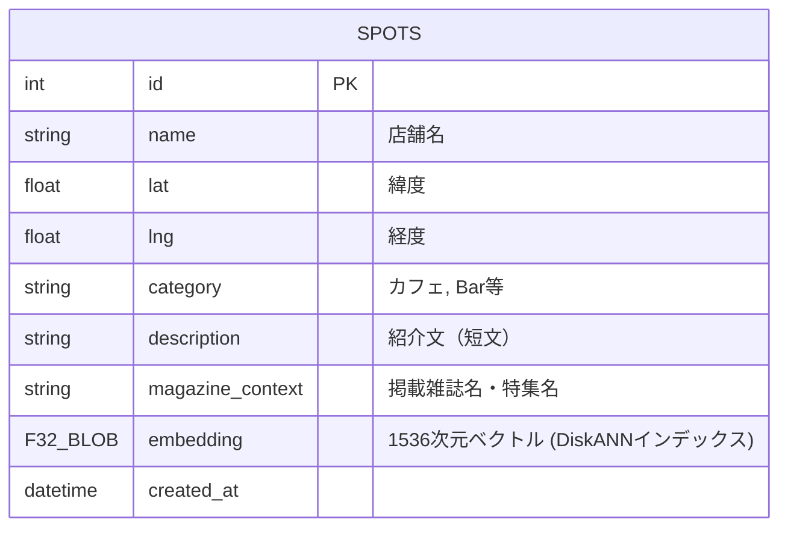

# 要件定義書：Context-Map (Web Application)

## 1. プロジェクト概要

- **名称:** Context-Map (仮)
- **目的:** 雑誌のような「文脈（Vibe）」で場所を探せる地図アプリケーション。
- **プラットフォーム:** Web (PWA対応前提)
- **コア技術:** Next.js (App Router), Turso (libSQL), Mapbox GL JS, OpenAI Embeddings.
- **ターゲット:** 効率性よりも「偶然の出会い」や「質の高い提案」を求める都市生活者。

## 2. システムアーキテクチャ (The Genius Stack)



### 技術スタック詳細

| レイヤー | 技術 |
|---------|------|
| Framework | Next.js 15+ (App Router) |
| Language | TypeScript (Strict mode) |
| Styling | Tailwind CSS (Mobile First) |
| Map Engine | Mapbox GL JS (Style: Monochrome/White) |
| Database | Turso (libSQL) |
| Extension | vector (for Embeddings) |
| ORM | Drizzle ORM |
| AI | OpenAI API (text-embedding-3-small) |

## 3. データベース設計 (ER図 & Schema)

Tursoの特性（SQLiteベース）を活かした、シンプルかつ強力なスキーマです。

### ER Diagram (Conceptual)



### Drizzle Schema Definition (`src/db/schema.ts`)

このコードをそのまま使用してください。

```typescript
import { sqliteTable, text, integer, real } from "drizzle-orm/sqlite-core";
import { sql } from "drizzle-orm";

export const spots = sqliteTable("spots", {
  id: integer("id").primaryKey({ autoIncrement: true }),
  name: text("name").notNull(),
  // 地理座標 (Mapbox用)
  lat: real("lat").notNull(),
  lng: real("lng").notNull(),
  // 画面表示用メタデータ
  category: text("category").notNull(), // アイコン出し分け用
  description: text("description"),     // UI上の吹き出し用
  magazineContext: text("magazine_context"), // 例: "BRUTUS 2024/02 読書特集"

  // 【重要】Vector Search用カラム (OpenAI text-embedding-3-small は 1536次元)
  // TursoのネイティブF32_BLOB型 + DiskANNインデックスを利用
  // Note: Drizzle ORMではcustomTypeで定義。実SQLはF32_BLOB(1536)
  embedding: text("embedding"), // 実装時はF32_BLOB(1536)として定義

  createdAt: text("created_at").default(sql`CURRENT_TIMESTAMP`),
});

export type Spot = typeof spots.$inferSelect;
export type NewSpot = typeof spots.$inferInsert;
```

## 4. UI/UX デザイン (ASCII Wireframe)

「余白の美」を意識したUIです。

### 画面1: メインマップ (Main Map View)

```
+---------------------------------------+
|  [ Context-Map ]              (Menu)  |
|                                       |
|             ( Map Area )              |
|   (White Monochrome Style)            |
|                                       |
|        [Pin]           [Pin]          |
|                                       |
|                [Pin]                  |
|                                       |
|                                       |
| +-----------------------------------+ |
| | (Search Bar: Floating Bottom)     | |
| | "静かな場所で本を読みたい..." [Go]| |
| +-----------------------------------+ |
+---------------------------------------+
```

- **Style:** 地図は白黒（彩度0）。建物も薄いグレー。ピンだけがアクセントカラー（例：黒に近い群青色）。
- **Search Bar:** 画面下部に固定（Floating）。iPhoneのKeyboardを考慮し、Focus時に上にスライド。

### 画面2: スポット詳細モーダル (Spot Detail)

ピンをクリックした際に下からスライドイン（Sheet UI）。

```
+---------------------------------------+
|                                       |
|          (Blurred Backdrop)           |
|                                       |
| +-----------------------------------+ |
| | [Drag Handle]                     | |
| |                                   | |
| |  ** 喫茶 琥珀 **                  | |
| |  [Cafe]  250m away                | |
| |                                   | |
| |  "創業50年。琥珀色の照明の中で    | |
| |   時間が止まる体験を。"           | |
| |                                   | |
| |  [ Context: 読書特集 2024 ]       | |
| |                                   | |
| |  [ Google Mapsで開く ]            | |
| +-----------------------------------+ |
+---------------------------------------+
```

## 5. コアロジック・アルゴリズム

Turso (SQLite) には PostGIS のような高度な地理計算関数（`ST_DWithin`など）が標準ではありません。
そのため、「ベクトル検索」と「Javascriptによる地理計算」のハイブリッドで実装します。

### 検索アルゴリズムフロー

1. **Input:** ユーザーがテキスト入力（例：「深夜に一人で考え事」）。
2. **Vectorize:** OpenAI APIで入力テキストをベクトル化（1536次元）。
3. **Semantic Search (Turso):**
   - ベクトル距離（Cosine Similarity）が近い順に **上位50件** を取得。
   - ※この時点では距離（km）は無視する。
4. **Geospatial Filter (Client/Edge):**
   - 取得した50件に対して、現在地からの距離を計算。
   - 指定半径（デフォルト: 3km）以内のものだけをフィルタリングし、近い順にソートしてUIに返す。

### 実装サンプルコード (`src/actions/search.ts`)

```typescript
'use server'
import { db } from "@/db";
import { spots } from "@/db/schema";
import OpenAI from "openai";
import { sql } from "drizzle-orm";

const openai = new OpenAI({ apiKey: process.env.OPENAI_API_KEY });

// 単純な距離計算 (Haversine Formula) - 軽量化のため近似式でも可
function getDistanceFromLatLonInKm(lat1: number, lon1: number, lat2: number, lon2: number) {
  var R = 6371; // Radius of the earth in km
  var dLat = deg2rad(lat2-lat1);
  var dLon = deg2rad(lon2-lon1);
  var a =
    Math.sin(dLat/2) * Math.sin(dLat/2) +
    Math.cos(deg2rad(lat1)) * Math.cos(deg2rad(lat2)) * Math.sin(dLon/2) * Math.sin(dLon/2);
  var c = 2 * Math.atan2(Math.sqrt(a), Math.sqrt(1-a));
  var d = R * c;
  return d;
}
function deg2rad(deg: number) { return deg * (Math.PI/180) }

export async function searchSpots(query: string, userLat: number, userLng: number) {
  // 1. Vectorize Query
  const embeddingResponse = await openai.embeddings.create({
    model: "text-embedding-3-small",
    input: query,
  });
  const vector = embeddingResponse.data[0].embedding;
  const vectorStr = JSON.stringify(vector);

  // 2. Vector Search using Turso's vector_top_k with DiskANN index
  // vector_top_k はDiskANNインデックスを活用した近似最近傍検索
  const candidates = await db.run(sql`
    SELECT s.id, s.name, s.lat, s.lng, s.category, s.description, s.magazine_context
    FROM vector_top_k('spots_idx', vector32(${vectorStr}), 50) AS v
    JOIN spots AS s ON s.rowid = v.id
  `);

  // 3. Server-side Geospatial Filtering (Server Actionsで実行)
  const results = candidates.rows.map((spot: any) => {
    const dist = getDistanceFromLatLonInKm(userLat, userLng, spot.lat, spot.lng);
    return { ...spot, distance: dist };
  }).filter(spot => spot.distance <= 3.0) // 3km圏内
    .sort((a, b) => a.distance - b.distance);

  return results;
}
```

## 6. ディレクトリ構造

```
/
├── public/              # Icons, Manifest
├── src/
│   ├── app/
│   │   ├── layout.tsx   # Global Layout (font, metadata)
│   │   ├── page.tsx     # Map View Component
│   │   └── actions.ts   # Server Actions (Search Logic)
│   ├── components/
│   │   ├── Map.tsx      # Mapbox Component
│   │   ├── SearchBar.tsx
│   │   └── SpotCard.tsx
│   ├── db/
│   │   ├── index.ts     # Turso Connection
│   │   └── schema.ts    # Drizzle Schema
│   └── lib/
│       └── utils.ts     # Distance calc, clsx
├── .env.local           # TURSO_DATABASE_URL, TURSO_AUTH_TOKEN, OPENAI_API_KEY, NEXT_PUBLIC_MAPBOX_TOKEN
├── drizzle.config.ts    # Drizzle Config
└── package.json
```
