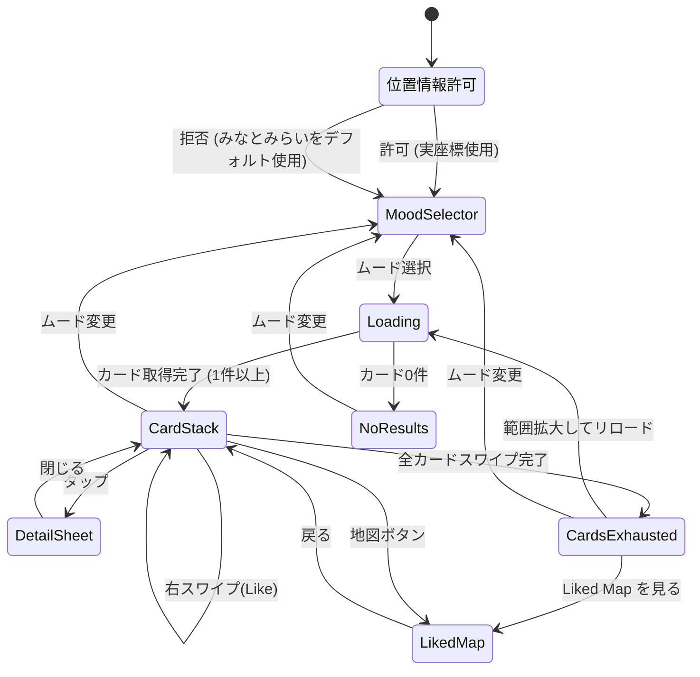

# VIBE MAP 実装計画書

| 項目 | 内容 |
|------|------|
| ドキュメントID | IMPL-VMAP-001 |
| バージョン | 2.0 |
| 作成日 | 2026-02-10 |
| 最終更新 | 2026-02-10 (レビュー指摘反映) |
| 対象スペック | `docs/vibe-map-spec.json` (v2.1.0) |
| ベースコード | context-map (Next.js 15 / React 19 / Turso / Mapbox) |

---

## 1. 現状分析とギャップ

### 1.1 現在のアーキテクチャ

```
[検索バー(テキスト入力)] → [OpenAI Embedding] → [Turso ベクトル検索]
                                                      ↓
                                              [Mapbox 地図上にピン表示]
                                                      ↓
                                              [SpotCard (Bottom Sheet)]
```

- **フレームワーク**: Next.js 15.1 (App Router) + React 19
- **UI**: 検索バー + 全画面 Mapbox GL JS 地図 + ピン + Bottom Sheet
- **データ**: Turso SQLite (spots テーブル + F32_BLOB ベクトルインデックス)
- **AI**: OpenAI text-embedding-3-small (検索ベクトル化のみ)
- **状態管理**: React useState のみ
- **アニメーション**: CSS transition のみ
- **デフォルト地点**: みなとみらい (35.4544, 139.6368) ※コード内コメントに「東京駅」と記載があるが、実座標はみなとみらい

### 1.2 VIBE MAP が要求する変化

| 領域 | 現状 | 目標 | ギャップ度 |
|------|------|------|-----------|
| UI パラダイム | 検索バー + 地図 | ムード選択 + スワイプカード | **大** |
| AI の役割 | Embedding 生成のみ | Vibe 解釈 (Gemini 2.5 Flash) + コピー生成 | **大** |
| データモデル | SpotRecord (生データ) | VibePlace (AI 解釈済み + Google Places 生データ複合) | **中** |
| 地図の役割 | メイン UI | 補助 (詳細時 + Liked Map でのみ展開) | **中** |
| 状態管理 | useState | Zustand (スワイプ履歴) | **中** |
| アニメーション | CSS transition | motion パッケージ (スワイプ) | **中** |
| Google Places API | searchNearby のみ | + Text Search (New) + reviews/photos フィールド追加 | **中** |
| フィルタリング | 距離 + ベクトル類似度 | + チェーン店除外 (二段階) | **小** |

---

## 2. 実装フェーズ

### Phase 2: AI Vibe パイプライン構築

> Phase 1 (Google Places API からのデータ取得) は既に完了済み。

#### 2-1. 依存パッケージ追加

```bash
npm install @google/genai            # Gemini SDK (※ @google/generative-ai は非推奨)
npm install zustand                   # 状態管理
npm install motion                    # アニメーション (※ framer-motion は React 19 非互換。import は 'motion/react' から)
```

> **注意**: `@google/generative-ai` (旧パッケージ) は非推奨であり、Gemini 2.5 以降のモデルとの互換性問題がある。必ず `@google/genai` を使用すること。
> **注意**: `framer-motion` は React 19 / Next.js 15 環境で peer dependency エラーを起こす。`motion` パッケージに移行済み。import は `import { motion, AnimatePresence } from 'motion/react'` を使用。

#### 2-2. VibePlace 型定義

**新規ファイル**: `src/types/vibe.ts`

```typescript
/** AI が採点するムード次元。UI の Mood 選択肢と 1:1 対応する。 */
export interface MoodScore {
  chill: number;    // 0-100
  party: number;    // 0-100
  focus: number;    // 0-100
}

/** Google の生データを AI が『意訳』した表示用データ */
export interface VibePlace {
  // --- AI 生成フィールド ---
  id: string;                  // Google Place ID
  name: string;
  catchphrase: string;         // AI 生成: 30 文字以内
  vibeTags: string[];          // AI 生成: 3 つ (例 ['#深夜の読書', '#照明暗め', '#一人時間'])
  heroImageUrl: string;        // Google Photos から PhotoCurator ロジックで選別
  moodScore: MoodScore;
  hiddenGemsInfo: string;      // レビューから抽出
  isRejected: boolean;         // チェーン店 = true

  // --- Google Places API 直接取得フィールド ---
  lat: number;
  lng: number;
  category: string;
  rating: number | null;
  address: string | null;
  openingHours: string[] | null;

  // --- クライアント側算出フィールド ---
  distance: number;            // km (Haversine)
}

/** UI のムード選択肢。MoodScore のキーと一致する。 */
export type Mood = 'chill' | 'party' | 'focus';

/** Gemini API から返却されるフォールバック用の劣化版 VibePlace */
export interface DegradedVibePlace extends VibePlace {
  isDegraded: true;            // AI 変換失敗時のフラグ
}
```

> **設計判断**: `MoodScore` のキー (`chill` / `party` / `focus`) は `Mood` 型と**完全に一致**させる。旧スペックの `romantic` は `party` に統合。これにより `moodScore[selectedMood]` でソートが安全に動作する。

#### 2-3. Gemini AI クライアント

**新規ファイル**: `src/lib/gemini-vibe.ts`

- **モデル**: Gemini 2.5 Flash (JSON Mode)
- **SDK**: `@google/genai` (`GoogleGenAI` クラス)
- System Prompt: スペックの `ai_architecture.system_prompt_template` を使用
- 入力: Google Places の生データ (**reviews, photos, attributes を含む**)
- 出力: `VibePlace` 型の JSON (JSON Schema バリデーション付き)
- エラーハンドリング:
  - リトライ: 最大 2 回 (指数バックオフ: 1s → 2s)
  - 429 (Rate Limit): サーキットブレーカーパターン (5 回連続 429 で全バッチ中止)
  - JSON パースエラー: `DegradedVibePlace` にフォールバック (プレースホルダーのキャッチコピー + moodScore 全 50)
  - タイムアウト: 10 秒

**処理フロー**:
```
[Google Places 生データ (reviews + photos 含む)]
  → [チェーン店プレフィルタ (name matching)]
  → [Vibe キャッシュ確認 (HIT → 即返却)]
  → [Gemini API (JSON Mode + Schema)]
  → [バリデーション + VibePlace 型パース]
  → [キャッシュ保存]
```

#### 2-4. Google Places API 拡張

**変更ファイル**: `src/lib/google-places.ts`

現在の `searchNearbyPlaces` に加え、以下を追加:

1. **`searchByText` 関数**: Text Search (New) API (`places:searchText`) を使用。ムード→日本語クエリ変換結果で検索
2. **FIELD_MASK 拡張**: `places.reviews`, `places.photos` を追加
3. **`GooglePlace` インターフェース拡張**: `reviews`, `photos` フィールドを追加
4. **Photo URL 構築ヘルパー**: `getPhotoUrl(photoName: string, maxWidth: number)` 関数

> **注意**: `places.reviews` と `places.photos` をリクエストすると Google Places API の**追加課金**が発生する。

#### 2-5. Vibe 変換 Server Action

**新規ファイル**: `src/app/vibe-actions.ts`

```
searchByMood(mood: Mood, lat: number, lng: number): Promise<VibePlace[]>
```

1. `mood` → Google Places Text Search **日本語**クエリに変換
   - `chill` → "静かな カフェ 落ち着いた雰囲気"
   - `party` → "にぎやか バー ナイトライフ 音楽"
   - `focus` → "作業 カフェ ワークスペース 静か"
2. Google Places API (New) **Text Search** 実行 (半径: DEFAULT_RADIUS_KM)
3. チェーン店プレフィルタ適用
4. Vibe キャッシュ確認 (キャッシュ HIT はスキップ)
5. Gemini API でバッチ Vibe 変換 (**並列 5 件ずつ**、最大 10 件。Rate Limit 対策)
6. `moodScore[mood]` **降順ソート** (型安全: `Mood` と `MoodScore` キーが一致)
7. `isRejected === true` を除外して結果返却

**エッジケース処理**:
- 全件チェーン店で除外 → 半径を 1.5 倍に広げてリトライ (1 回のみ)
- Google Places 結果 0 件 → `{ success: true, data: [], message: '近くにスポットが見つかりませんでした' }` を返却
- 位置情報拒否時 → `DEFAULT_LAT` / `DEFAULT_LNG` (みなとみらい) を使用

#### 2-6. チェーン店除外フィルタ

**新規ファイル**: `src/lib/chain-filter.ts`

```typescript
/**
 * チェーン店判定。完全一致ではなく「ブランド名を含むか」で判定。
 * 偽陽性リスク: 'Jonathan' → 'Jonathan's Artisan Bakery' に誤マッチし得る。
 * 対策: 日本語名を優先マッチし、英語名は語境界チェックを追加。
 */
const CHAIN_PATTERNS: Array<{ ja: string; en: RegExp }> = [
  { ja: 'スターバックス', en: /\bStarbucks\b/i },
  { ja: 'マクドナルド',   en: /\bMcDonald'?s?\b/i },
  { ja: 'サイゼリヤ',     en: /\bSaizeriya\b/i },
  { ja: 'ガスト',         en: /\bGusto\b/i },
  { ja: 'ジョナサン',     en: /\bJonathan'?s?\b/i },
  { ja: 'デニーズ',       en: /\bDenny'?s?\b/i },
  { ja: 'ドトール',       en: /\bDoutor\b/i },
  { ja: 'タリーズ',       en: /\bTully'?s?\b/i },
  { ja: 'コメダ',         en: /\bKomeda\b/i },
  { ja: '吉野家',         en: /\bYoshinoya\b/i },
  { ja: 'すき家',         en: /\bSukiya\b/i },
  { ja: '松屋',           en: /\bMatsuya\b/i },
  // 拡張可能
];

export function isChainStore(name: string): boolean {
  return CHAIN_PATTERNS.some(({ ja, en }) =>
    name.includes(ja) || en.test(name)
  );
}
```

> **改善点**: substring match (`includes`) ではなく、英語名は `\b` (語境界) 付き正規表現で偽陽性を低減。日本語名は substring match のまま (語境界概念がないため)。

#### 2-7. Vibe キャッシュテーブル

**新規マイグレーション**: `drizzle/0003_add_vibe_cache.sql`

```sql
CREATE TABLE IF NOT EXISTS vibe_places_cache (
  place_id TEXT PRIMARY KEY,          -- Google Place ID (string)
  mood TEXT NOT NULL,                  -- 'chill' | 'party' | 'focus'
  vibe_json TEXT NOT NULL,            -- JSON 文字列 (VibePlace)
  created_at TEXT DEFAULT CURRENT_TIMESTAMP,
  expires_at TEXT NOT NULL            -- TTL: created_at + 7 days
);

CREATE INDEX idx_vibe_cache_mood_expires ON vibe_places_cache(mood, expires_at);
```

**Drizzle スキーマ追加**: `src/db/schema.ts` に `vibePlacesCache` テーブル定義を追加。

> **注意**: キャッシュキーは `place_id + mood` の複合。同じ場所でもムードが異なれば moodScore のソート結果が異なるため、ムード別にキャッシュする。

---

### Phase 3: Tinder 風スワイプ UI

#### 3-1. Zustand ストア

**新規ファイル**: `src/store/vibe-store.ts`

```typescript
import { create } from 'zustand';
import type { VibePlace, Mood } from '@/types/vibe';

interface VibeState {
  currentMood: Mood | null;
  cards: VibePlace[];
  likedPlaces: VibePlace[];
  passedIds: string[];           // ※ Set<string> は JSON シリアライズ不可のため string[] を使用
  isLoading: boolean;
  isExhausted: boolean;          // 全カードをスワイプ済み

  // Actions
  setMood: (mood: Mood) => void;
  loadCards: (lat: number, lng: number) => Promise<void>;
  like: (place: VibePlace) => void;
  pass: (placeId: string) => void;
  reset: () => void;
}
```

> **設計判断**: `passedIds` を `Set<string>` ではなく `string[]` にした理由:
> - Zustand の `persist` ミドルウェア使用時に `Set` は `{}` にシリアライズされる
> - Next.js の Server Component / Client Component 境界を跨ぐ際にシリアライズエラーが発生する
> - 判定は `.includes()` で O(n) だが、1 セッションの Pass 数は最大数十件なので問題なし

#### 3-2. 新規コンポーネント

| コンポーネント | ファイル | 責務 |
|---------------|---------|------|
| `MoodSelector` | `src/components/MoodSelector.tsx` | オンボーディング。Chill / Party / Focus の 3 択ボタン。ARIA ラベル付き |
| `CardStack` | `src/components/CardStack.tsx` | スワイプカードスタック。`motion/react` の `AnimatePresence` + ドラッグジェスチャー |
| `VibeCard` | `src/components/VibeCard.tsx` | 個別カード。ヒーロー画像背景 + キャッチコピー + VibeBadge |
| `VibeBadge` | `src/components/VibeBadge.tsx` | Glassmorphism タグ (`backdrop-blur`, 白ボーダー) |
| `LikePassButtons` | `src/components/LikePassButtons.tsx` | アクセシビリティ用 Like/Pass ボタン (カード下部) |
| `LikedMap` | `src/components/LikedMap.tsx` | Like した場所だけをプロットした地図 (既存 Mapbox Map.tsx を再利用) |
| `CardsExhausted` | `src/components/CardsExhausted.tsx` | 全カードスワイプ後: 範囲拡大 / ムード変更 / Liked Map の 3 択 |
| `PhotoCurator` | `src/lib/photo-curator.ts` | Photos 配列から interior/atmosphere 系を優先選別するユーティリティ |

#### 3-3. CardStack スワイプ実装

```typescript
import { motion, AnimatePresence } from 'motion/react';

// ※ 'framer-motion' ではなく 'motion/react' を使用
```

**スワイプ判定ロジック** (単位: px / px/s):
- 右スワイプ (x > 100px or velocity.x > 500px/s): Like → `store.like(place)`
- 左スワイプ (x < -100px or velocity.x < -500px/s): Pass → `store.pass(place.id)`
- タップ (drag 距離 < 5px): 詳細展開 (地図 + 全情報)
- **Y 軸デッドゾーン**: `|y| > |x| * 1.5` の場合はスワイプを無効化 (スクロール誤判定防止)

**キーボード操作** (アクセシビリティ):
- `→` キー: Like
- `←` キー: Pass
- `Enter` / `Space`: 詳細展開
- `Escape`: 詳細閉じ

**`touch-action: none`** を CardStack 要素に設定し、iOS Safari のブラウザスクロールとの競合を防止。

#### 3-4. ページ構成の変更

**`src/app/page.tsx` の刷新**:

```
現状: <Map> + <SearchBar> + <SortToggle> + <SpotCard>
  ↓
目標:
  if (!mood)        → <MoodSelector />
  if (loading)      → <LoadingAnimation /> (スケルトンカード)
  if (cards.length) → <CardStack /> + <LikePassButtons /> + <LikedCountBadge />
  if (exhausted)    → <CardsExhausted />
  タップ時          → <DetailSheet /> (Mapbox 地図展開含む)
  地図ビュー切替    → <LikedMap /> (既存 Map.tsx ベース)
```

#### 3-5. 画面遷移フロー



---

### Phase 4: チェーン店除外フィルタの調整

#### 4-1. 二段階フィルタリング

1. **プレフィルタ (name matching)**: `chain-filter.ts` で Gemini API 呼び出し前に除外 (API コスト削減)
2. **AI フィルタ (Gemini)**: `is_rejected: true` を返した場所を結果から除外 (プレフィルタで漏れたチェーン店を補足)

#### 4-2. フィルタリスト管理

- 初期リストはハードコード (Phase 2-6 参照)
- Gemini が `is_rejected` を返した場所の name を定期的にレビューし、リストに追加
- 将来的には DB テーブルまたは設定ファイルに外出しを検討

---

### Phase 5: グロース機能

#### 5-1. OG 画像生成 API

**新規ファイル**: `src/app/api/og/route.tsx`

Vercel OG Image (`@vercel/og`) を使用し、Liked した店の写真と AI キャッチコピーを合成した画像を動的生成。

#### 5-2. Vibe シェア機能

- 選択したムード + Liked スポット群のまとめシェア
- シェア URL → OG 画像付きメタタグ → SNS 上でのプレビュー表示

---

## 3. 新規ファイル一覧

```
src/
├── types/
│   └── vibe.ts                    # VibePlace, Mood, MoodScore, DegradedVibePlace 型定義
├── lib/
│   ├── gemini-vibe.ts             # Gemini 2.5 Flash クライアント (@google/genai)
│   ├── chain-filter.ts            # チェーン店除外ロジック (正規表現 + 日本語 substring)
│   └── photo-curator.ts           # Photos 配列から interior/atmosphere 優先選別
├── store/
│   └── vibe-store.ts              # Zustand ストア (passedIds: string[])
├── app/
│   ├── vibe-actions.ts            # searchByMood Server Action
│   └── api/
│       └── og/
│           └── route.tsx          # OG 画像生成 (Phase 5)
├── components/
│   ├── MoodSelector.tsx           # ムード選択 UI (ARIA 対応)
│   ├── CardStack.tsx              # スワイプカードスタック (motion/react)
│   ├── VibeCard.tsx               # 個別 Vibe カード
│   ├── VibeBadge.tsx              # Glassmorphism タグ
│   ├── LikePassButtons.tsx        # アクセシビリティ用 Like/Pass ボタン
│   ├── LikedMap.tsx               # Like した場所の Mapbox 地図
│   └── CardsExhausted.tsx         # 全カードスワイプ後の 3 択 UI
drizzle/
└── 0003_add_vibe_cache.sql        # Vibe キャッシュテーブルマイグレーション
```

## 4. 変更ファイル一覧

| ファイル | 変更内容 |
|---------|---------|
| `package.json` | `@google/genai`, `zustand`, `motion` 追加 |
| `src/app/page.tsx` | 検索バー + 地図 → ムード選択 + カードスタック に全面刷新 |
| `src/lib/constants.ts` | ムード別クエリ定数 (日本語)、スワイプ閾値定数の追加 |
| `src/lib/google-places.ts` | `searchByText` 関数追加 + FIELD_MASK に `places.reviews`, `places.photos` 追加 + `GooglePlace` インターフェース拡張 |
| `src/db/schema.ts` | `vibePlacesCache` テーブル定義追加 |

## 5. 環境変数 (追加)

| 変数名 | 用途 | 備考 |
|--------|------|------|
| `GEMINI_API_KEY` | Gemini 2.5 Flash API キー | サーバーサイドのみ。Google Cloud でレート制限 + 日次予算アラートを設定すること |

> **注意**: 地図は既存の Mapbox を継続使用するため、`NEXT_PUBLIC_GOOGLE_MAPS_API_KEY` は不要。`NEXT_PUBLIC_MAPBOX_TOKEN` が引き続き使用される。
>
> **既存変数の扱い**:
> - `GOOGLE_PLACES_API_KEY`: 継続使用 (Text Search + Place Details)
> - `OPENAI_API_KEY`: **Phase 3 完了後に廃止検討**。現在の Embedding ベース検索がムードベース検索に完全置換された時点で不要になる。過渡期は両方保持。
> - `TURSO_DATABASE_URL`, `TURSO_AUTH_TOKEN`: 継続使用 (Vibe キャッシュ用に拡張)

---

## 6. 実装優先順序とタスク分割

### Phase 2 タスク (AI パイプライン)

| # | タスク | 依存 | 見積り |
|---|-------|------|--------|
| 2-1 | `npm install` (@google/genai, zustand, motion) | - | S |
| 2-2 | `src/types/vibe.ts` 型定義 | - | S |
| 2-3 | `src/lib/chain-filter.ts` チェーン店フィルタ + テスト | - | S |
| 2-4 | `drizzle/0003_add_vibe_cache.sql` マイグレーション + スキーマ更新 | - | S |
| 2-5 | `src/lib/google-places.ts` に searchByText + reviews/photos 対応 + テスト | - | M |
| 2-6 | `src/lib/photo-curator.ts` 写真選別ロジック + テスト | 2-5 | S |
| 2-7 | `src/lib/gemini-vibe.ts` Gemini クライアント + テスト | 2-2 | M |
| 2-8 | `src/app/vibe-actions.ts` Server Action + テスト | 2-3, 2-4, 2-5, 2-7 | L |

### Phase 3 タスク (スワイプ UI)

| # | タスク | 依存 | 見積り |
|---|-------|------|--------|
| 3-1 | `src/store/vibe-store.ts` Zustand ストア + テスト | 2-2 | M |
| 3-2 | `MoodSelector` コンポーネント + テスト | - | S |
| 3-3 | `VibeBadge` コンポーネント + テスト | - | S |
| 3-4 | `LikePassButtons` コンポーネント + テスト | - | S |
| 3-5 | `VibeCard` コンポーネント + テスト | 3-3, 2-6 | M |
| 3-6 | `CardStack` コンポーネント (スワイプ + キーボード) + テスト | 3-1, 3-4, 3-5 | L |
| 3-7 | `CardsExhausted` コンポーネント + テスト | 3-1 | S |
| 3-8 | `LikedMap` コンポーネント + テスト | 3-1 | M |
| 3-9 | `page.tsx` 全面刷新 + テスト | 3-2, 3-6, 3-7, 3-8 | L |
| 3-10 | 旧コンポーネント削除 (SearchBar, SortToggle, 旧 SpotCard, 旧 actions.ts) + 旧テスト削除 | 3-9 | S |

### Phase 4 タスク (フィルタ調整)

| # | タスク | 依存 | 見積り |
|---|-------|------|--------|
| 4-1 | チェーン店リスト拡充 + Gemini `is_rejected` 連携テスト | 2-3, 2-7 | S |

### Phase 5 タスク (グロース機能)

| # | タスク | 依存 | 見積り |
|---|-------|------|--------|
| 5-1 | Vercel OG Image 動的生成 API | 3-1 | M |
| 5-2 | Vibe シェア機能 + SNS メタタグ | 5-1 | M |

**見積り凡例**: S = 1-2h, M = 3-5h, L = 6-10h

---

## 7. 技術的リスクと対策

| リスク | 影響 | 対策 |
|-------|------|------|
| Gemini API レスポンス遅延 (2-5s) | カード表示まで 3 秒超 | バッチ 5 件並列 + スケルトンカード表示 + キャッシュ (再訪時は即表示) |
| Gemini JSON 出力の不安定さ | パースエラー | JSON Schema 指定 + バリデーション + `DegradedVibePlace` フォールバック |
| Gemini 429 (Rate Limit) | バッチ全体が失敗 | サーキットブレーカー (5 連続 429 → バッチ中止) + 指数バックオフ |
| Google Places Photos 取得制限 | ヒーロー画像なし | カテゴリ別グラデーション背景フォールバック |
| iOS Safari でスワイプ競合 | ドラッグがブラウザスクロールに取られる | `touch-action: none` + Y 軸デッドゾーン + 実機テスト必須 |
| Gemini API コスト爆発 | 10 件/リクエスト × 多ユーザー | Turso キャッシュ (TTL 7日) + 日次予算アラート (Google Cloud) + 並列数制限 (5件/バッチ) |
| 全件チェーン店で結果 0 件 | ユーザーに何も表示されない | 半径 1.5 倍リトライ (1 回) + `NoResults` UI 状態 |
| `motion` パッケージの API 差異 | framer-motion 前提のサンプルコードが動かない | 公式移行ガイド (motion.dev/docs/react-upgrade-guide) を参照。import パスのみ変更で大部分は互換 |

---

## 8. 既存コードとの共存戦略

現在の context-map (検索バー + 地図) のコードは**段階的に置き換える**。

### 移行タイムライン

| タイミング | 状態 |
|-----------|------|
| Phase 2 中 | 既存 UI はそのまま動作。新 Server Action + AI パイプラインを並行開発 |
| Phase 3 開始時 | `page.tsx` を刷新。旧コンポーネントは参照されなくなるが一旦残す |
| Phase 3 完了後 (タスク 3-10) | 旧コンポーネント + 旧テストを削除 |

### 保持するもの

| ファイル | 理由 | 変更 |
|---------|------|------|
| `src/db/schema.ts` | DB 接続基盤 | `vibePlacesCache` テーブル追加 |
| `src/db/index.ts` | DB クライアント | 変更なし |
| `src/lib/geo.ts` | Haversine 距離計算 | 変更なし |
| `src/lib/google-places.ts` | Google Places API クライアント | `searchByText` + reviews/photos 対応追加 |
| `src/lib/constants.ts` | 共通定数 | ムードクエリ + スワイプ閾値追加 |
| `src/components/Map.tsx` | Mapbox 地図 | `LikedMap` の内部実装として再利用 |

### 削除するもの (Phase 3 完了後、タスク 3-10)

| ファイル | 理由 |
|---------|------|
| `src/components/SearchBar.tsx` + 2 テストファイル | MoodSelector に置換 |
| `src/components/SortToggle.tsx` + テスト | moodScore ソートに置換 |
| `src/components/SpotCard.tsx` + 2 テストファイル | VibeCard + DetailSheet に置換 |
| `src/app/actions.ts` + テスト | vibe-actions.ts に置換 |
| `src/app/page.test.tsx` 系 4 ファイル | 新 page.tsx テストで置換 |

### テスト影響分析

| カテゴリ | ファイル数 | 対応 |
|---------|-----------|------|
| **削除** (旧 UI テスト) | 10 ファイル | Phase 3 新テストで置換 |
| **生存** (インフラ) | 4 ファイル (geo.test, google-places.test, Map.test, Map系) | そのまま保持。google-places.test は searchByText 用テスト追加 |
| **要修正** | 2 ファイル (layout.test.tsx: タイトル変更、Map.pins.test: props 型変更) | Phase 3-9 で対応 |

### OpenAI → Gemini 移行戦略

| フェーズ | OpenAI | Gemini | 備考 |
|---------|--------|--------|------|
| Phase 2 完了時 | Embedding 検索 (既存) + Vibe 変換なし | Vibe 変換あり | 両方動作。旧検索 UI からは OpenAI、新 Vibe UIからは Gemini |
| Phase 3 完了時 | 未使用 (旧 searchSpots 削除済み) | Vibe 変換のみ | `openai` パッケージ + `OPENAI_API_KEY` を package.json / .env から削除可能 |

---

## 9. コスト見積り

### API コスト (月間、100 DAU 想定)

| API | 単価 | 想定使用量 | 月間コスト |
|-----|------|-----------|-----------|
| Gemini 2.5 Flash (入力) | $0.15 / 1M tokens | 100 users × 3 mood/day × 10 places × ~2K tokens = 180M tokens | ~$27 |
| Gemini 2.5 Flash (出力) | $0.60 / 1M tokens | 同上 × ~500 tokens 出力 = 45M tokens | ~$27 |
| Google Places Text Search | $32 / 1K requests | 100 × 3 = 9K requests | ~$288 |
| Google Places Photos | $7 / 1K requests | 9K × 10 photos = 90K requests | ~$630 |
| **合計** | | | **~$972** |

> **キャッシュ効果**: TTL 7 日のキャッシュにより、リピートユーザーの API コールは大幅に削減される。同一エリア・同一ムードの結果はキャッシュから返却。実効コストは上記の **30-50%** と推定。

### コスト制御策

1. Google Cloud で日次予算アラート ($50/day) を設定
2. Gemini API にリクエスト数上限 (1000 req/day) を設定
3. Google Places Photos は最大 3 枚/place に制限 (全写真取得しない)
4. キャッシュ TTL を状況に応じて調整 (コスト高 → TTL 延長)
