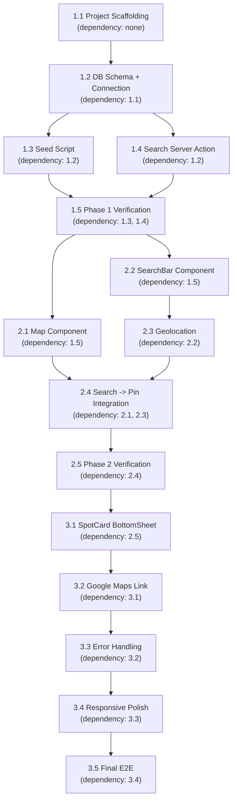

# Work Plan: Context-Map MVP

| 項目 | 内容 |
|------|------|
| ドキュメントID | WP-CTXMAP-001 |
| バージョン | 1.0 |
| 作成日 | 2026-02-10 |
| ステータス | Draft |
| 実装アプローチ | Vertical Slice (Design Doc準拠) |
| 戦略 | Strategy B: Implementation-First Development |

---

## 前提ドキュメント

| ドキュメント | パス | 参照内容 |
|-------------|------|---------|
| PRD | `docs/prd.md` | 機能要件(F-001~F-008)、受入基準(AC-001~AC-008)、非機能要件 |
| Design Doc | `docs/design-doc.md` | 実装アプローチ(3 Phase Vertical Slice)、コンポーネント設計、統合ポイント |
| ADR-0001 | `docs/adr/ADR-0001-technology-stack.md` | Next.js 15 + Turso + Mapbox + OpenAI |
| ADR-0002 | `docs/adr/ADR-0002-vector-search-architecture.md` | 2段階ハイブリッド方式 |
| ADR-0003 | `docs/adr/ADR-0003-embedding-storage-strategy.md` | F32_BLOB(1536) + DiskANN |
| idea.md | `docs/idea.md` | 要件定義、スキーマ定義サンプル、検索ロジックサンプル |

---

## Phase Structure Diagram

```mermaid
graph LR
    subgraph "Phase 1: Data Foundation + Search Core"
        P1T1["1.1 Project Scaffolding"]
        P1T2["1.2 DB Schema + Connection"]
        P1T3["1.3 Seed Script"]
        P1T4["1.4 Search Server Action"]
        P1T5["1.5 Phase 1 Integration Verification"]
    end

    subgraph "Phase 2: Map UI + Search Integration"
        P2T1["2.1 Map Component"]
        P2T2["2.2 SearchBar Component"]
        P2T3["2.3 Geolocation + Fallback"]
        P2T4["2.4 Search -> Pin Integration"]
        P2T5["2.5 Phase 2 Integration Verification"]
    end

    subgraph "Phase 3: Spot Detail + Polish"
        P3T1["3.1 SpotCard BottomSheet"]
        P3T2["3.2 Google Maps Link"]
        P3T3["3.3 Error Handling Integration"]
        P3T4["3.4 Responsive + Mobile Polish"]
        P3T5["3.5 Final E2E Verification"]
    end

    P1T1 --> P1T2 --> P1T3 --> P1T4 --> P1T5
    P1T5 --> P2T1
    P1T5 --> P2T2
    P2T1 --> P2T4
    P2T2 --> P2T3 --> P2T4 --> P2T5
    P2T5 --> P3T1 --> P3T2 --> P3T3 --> P3T4 --> P3T5
```



## Task Dependency Diagram



---

## Phase 1: Data Foundation + Search Core

**Goal**: Seed data to Turso, implement vector search Server Action, verify E2E search flow at L2 level.

**Verification Level**: L2 (Integration -- Server Action calls OpenAI + Turso and returns filtered results)

### Task 1.1: Project Scaffolding and Configuration

- [x] **Complete**

**Goal**: Next.js 15 project initialized with all dependencies, TypeScript strict mode, Tailwind CSS, environment variables configured.

**Target Files**:
- `package.json` [new]
- `tsconfig.json` [new]
- `next.config.ts` [new]
- `tailwind.config.ts` [new]
- `src/app/layout.tsx` [new] (minimal)
- `src/app/page.tsx` [new] (placeholder)
- `.env.local` [new] (template)
- `.gitignore` [new]
- `drizzle.config.ts` [new]

**Dependencies**: None

**Work Items**:
1. `npx create-next-app@latest` with App Router, TypeScript strict, Tailwind CSS, src/ directory
2. Install project dependencies:
   - `@libsql/client` -- Turso client
   - `drizzle-orm` -- ORM
   - `drizzle-kit` -- Migration tool
   - `openai` -- OpenAI SDK
   - `react-map-gl` -- Mapbox React wrapper
   - `mapbox-gl` -- Mapbox GL JS
3. Configure `drizzle.config.ts` for Turso (libSQL driver)
4. Create `.env.local` template with all 4 environment variables:
   - `TURSO_DATABASE_URL`
   - `TURSO_AUTH_TOKEN`
   - `OPENAI_API_KEY`
   - `NEXT_PUBLIC_MAPBOX_TOKEN`
5. Verify `npm run dev` starts without errors

**Acceptance Criteria**:
- [x] `npm run dev` starts Next.js development server successfully
- [x] TypeScript strict mode enabled in `tsconfig.json`
- [x] All dependencies installed and resolvable
- [x] Environment variable template exists
- [x] `drizzle.config.ts` configured for Turso

---

### Task 1.2: Database Schema Definition and Connection Setup

- [x] **Complete**

**Goal**: Turso DB connection established, `spots` table with F32_BLOB(1536) and DiskANN index created via Drizzle migration.

**Target Files**:
- `src/db/index.ts` [new] -- Turso connection
- `src/db/schema.ts` [new] -- Drizzle schema definition
- `src/types/spot.ts` [new] -- Type definitions
- `src/lib/constants.ts` [new] -- Constants
- `drizzle/` [new] -- Migration directory

**Dependencies**: Task 1.1

**Work Items**:
1. Implement `src/db/index.ts` -- Turso client creation with `drizzle()` wrapper
2. Implement `src/db/schema.ts` -- Drizzle schema for `spots` table
   - Note: `embedding` column is `F32_BLOB(1536)` which requires custom SQL migration since Drizzle ORM cannot directly express this type
3. Implement `src/types/spot.ts` -- `SpotRecord`, `SearchResult`, `UserLocation` types (per Design Doc)
4. Implement `src/lib/constants.ts` -- All constants (per Design Doc):
   - `VECTOR_TOP_K = 50`
   - `DEFAULT_RADIUS_KM = 3.0`
   - `MAX_QUERY_LENGTH = 200` / `MIN_QUERY_LENGTH = 1`
   - `DEFAULT_LAT = 35.6812` / `DEFAULT_LNG = 139.7671` / `DEFAULT_ZOOM = 14`
   - `EMBEDDING_MODEL`, `EMBEDDING_DIMENSIONS`, `EMBEDDING_TIMEOUT_MS`
   - `MAP_STYLE`, `PIN_COLOR`
5. Create custom SQL migration for `spots` table with `F32_BLOB(1536)`:
   ```sql
   CREATE TABLE spots (
     id INTEGER PRIMARY KEY AUTOINCREMENT,
     name TEXT NOT NULL,
     lat REAL NOT NULL,
     lng REAL NOT NULL,
     category TEXT NOT NULL,
     description TEXT,
     magazine_context TEXT,
     embedding F32_BLOB(1536),
     created_at TEXT DEFAULT CURRENT_TIMESTAMP
   );
   CREATE INDEX spots_idx ON spots (
     libsql_vector_idx(embedding, 'metric=cosine')
   );
   ```
6. Run migration against Turso DB and verify schema creation

**Acceptance Criteria**:
- [x] `src/db/index.ts` successfully connects to Turso (verified by running a simple query)
- [x] `spots` table exists with `F32_BLOB(1536)` column and DiskANN index
- [x] TypeScript types match Design Doc interface definitions exactly
- [x] All constants match Design Doc `constants.ts` specification
- [x] AC-008 partial: DB schema supports all required fields (name, lat, lng, category, description, magazine_context, embedding)

---

### Task 1.3: Seed Script Implementation and Data Ingestion

- [x] **Complete**

**Goal**: `seed.ts` script populates Turso with Tokyo area spot data including pre-computed embeddings.

**Target Files**:
- `seed.ts` [new] -- Seed script (project root)
- `src/data/spots.json` [new] (optional: raw spot data before embedding)

**Dependencies**: Task 1.2

**Work Items**:
1. Design seed data: 20-50 spots in Tokyo area with:
   - name, lat, lng, category, description, magazine_context
   - Variety of categories (Cafe, Bar, Bookstore, Gallery, Park, etc.)
   - Variety of magazine contexts (BRUTUS, Hanako, etc.)
   - Geographic spread across central Tokyo
2. Implement `seed.ts`:
   - Import Turso client and OpenAI SDK
   - For each spot, call `openai.embeddings.create()` with the spot's description + magazine_context as input
   - Insert into `spots` table using `vector32()` function for embedding
   - Wrap in transaction to prevent partial insertion on error
   - Add progress logging
3. Execute seed script and verify data
4. Add `"seed"` npm script to `package.json`: `"seed": "npx tsx seed.ts"`

**Acceptance Criteria**:
- [x] AC-008: `npm run seed` executes successfully and inserts all spot data
- [x] Each spot has all required fields populated including embedding (F32_BLOB)
- [x] Transaction rollback on error (no partial data)
- [x] Console output confirms number of spots inserted
- [x] Data variety: at least 3 distinct categories, at least 2 distinct magazine contexts

---

### Task 1.4: Search Server Action (searchSpots) with Haversine Filtering

- [x] **Complete**

**Goal**: `searchSpots` Server Action implements full search pipeline: validation -> embedding -> vector search -> distance filter -> response.

**Target Files**:
- `src/app/actions.ts` [new] -- Server Action
- `src/lib/geo.ts` [new] -- Haversine distance utility

**Dependencies**: Task 1.2

**Work Items**:
1. Implement `src/lib/geo.ts`:
   - `getDistanceFromLatLonInKm(lat1, lng1, lat2, lng2): number` -- Haversine formula
   - Pure function, independently testable
2. Implement `src/app/actions.ts` with `'use server'` directive:
   - Input validation (query: 1-200 chars, trim, no whitespace-only; lat: -90~90; lng: -180~180)
   - OpenAI Embedding API call with 5-second timeout
   - Turso `vector_top_k` query (Raw SQL with JOIN):
     ```sql
     SELECT s.id, s.name, s.lat, s.lng, s.category, s.description, s.magazine_context
     FROM vector_top_k('spots_idx', vector32(?), 50) AS v
     JOIN spots AS s ON s.rowid = v.id
     ```
   - Haversine distance calculation for each result
   - Filter to `DEFAULT_RADIUS_KM` (3km) and sort by distance ascending
   - Return `SearchResponse` type (success/error discriminated union)
3. Error handling per Design Doc:
   - `VALIDATION_ERROR` for input issues
   - `EMBEDDING_ERROR` for OpenAI API failures/timeouts
   - `DB_ERROR` for Turso connection/query failures
   - `UNKNOWN_ERROR` for unexpected errors
   - Never expose technical details to client

**Acceptance Criteria**:
- [x] AC-001: Semantic search returns relevant spots for natural language input
- [x] AC-006: Haversine distance correctly calculated, 3km filter applied, results sorted by distance ascending
- [x] Input validation rejects empty strings, 201+ characters, whitespace-only
- [x] OpenAI API timeout at 5 seconds with proper error response
- [x] DB errors return proper error response
- [x] `SearchResponse` type matches Design Doc exactly

---

### Task 1.5: Phase 1 Integration Verification

- [ ] **Complete**

**Goal**: Verify end-to-end search pipeline works: seeded data is queryable via Server Action.

**Target Files**: No new files (verification only)

**Dependencies**: Task 1.3, Task 1.4

**Verification Procedure**:
1. Run `npm run seed` to populate database
2. Create a temporary test script or use Node REPL to:
   - Import `searchSpots` from `src/app/actions.ts`
   - Call `searchSpots("quiet coffee shop", 35.6812, 139.7671)`
   - Verify response has `success: true` and `data` contains relevant spots
   - Verify each result has distance calculated and is within 3km
   - Verify results are sorted by distance ascending
3. Test error paths:
   - Call with empty query -> `VALIDATION_ERROR`
   - Call with 201-char query -> `VALIDATION_ERROR`
4. Verify OpenAI API integration is working (embedding generation)
5. Verify Turso vector search returns results

**Acceptance Criteria**:
- [ ] `searchSpots` returns relevant results for at least 3 different natural language queries
- [ ] Distance values are plausible (non-negative, in km)
- [ ] Validation errors returned for invalid inputs
- [ ] Full pipeline completes in under 2 seconds (local measurement)
- [ ] Phase 1 covers: AC-001 (partial), AC-006, AC-008

---

## Phase 2: Map UI + Search Integration

**Goal**: Full-screen monochrome map with search bar, search results displayed as pins, geolocation with fallback.

**Verification Level**: L2 (Integration -- search from browser, pins appear on map)

### Task 2.1: Map Component (Mapbox GL JS, Monochrome Style)

- [x] **Complete**

**Goal**: Full-screen Mapbox map with monochrome/white style rendering correctly on desktop and mobile.

**Target Files**:
- `src/components/Map.tsx` [new] -- Client Component

**Dependencies**: Task 1.5 (Phase 1 complete)

**Work Items**:
1. Implement `src/components/Map.tsx` as `'use client'` component using `react-map-gl` (v8):
   - `Map` component from react-map-gl with `mapboxAccessToken`
   - Map style: `mapbox://styles/mapbox/light-v11` (monochrome/white, per Design Doc)
   - Initial viewport: center on `initialCenter` prop, zoom `DEFAULT_ZOOM` (14)
   - Full-screen: `width: 100vw, height: 100vh` (or 100dvh for mobile)
   - Interactive: drag, pinch zoom enabled
   - State: `viewState` managed with `onMove` handler
2. Integrate into `src/app/page.tsx`:
   - Import Map component dynamically with `next/dynamic` (SSR disabled for Mapbox)
   - Pass `initialCenter` prop (default: Tokyo Station)
3. Add Mapbox GL CSS import in layout or component
4. Verify map renders on desktop Chrome and mobile viewport

**Acceptance Criteria**:
- [x] AC-002: Full-screen monochrome map displays on page load
- [x] AC-002: Map supports drag and pinch zoom
- [x] Map style is white/monochrome (light-v11), buildings in light gray
- [x] No Mapbox token exposed in client-side code beyond `NEXT_PUBLIC_MAPBOX_TOKEN`
- [x] Map renders without errors on desktop and mobile viewport sizes

---

### Task 2.2: SearchBar Component (UI and Server Action Integration)

- [x] **Complete**

**Goal**: Floating search bar at bottom of screen, calls `searchSpots` Server Action, manages loading state.

**Target Files**:
- `src/components/SearchBar.tsx` [new] -- Client Component

**Dependencies**: Task 1.5 (Phase 1 complete)

**Work Items**:
1. Implement `src/components/SearchBar.tsx` as `'use client'` component:
   - Text input with placeholder (e.g., "How do you feel today?")
   - Submit button/icon
   - State: `query` (string), `isSearching` (boolean)
   - Form submission triggers `searchSpots` Server Action via `useTransition`
   - Passes `userLocation` (lat, lng) to Server Action
   - Loading indicator during search
   - Calls `onResults` callback with search results
2. Styling (Tailwind CSS, mobile-first):
   - Fixed position at bottom of screen (above safe area)
   - Floating card style with rounded corners, subtle shadow
   - Input field with appropriate padding for mobile tap targets
   - Focus state: slight upward slide to avoid keyboard overlap
3. Input validation feedback:
   - Disable submit when query is empty
   - Show character count approaching 200-char limit
4. Error display:
   - Show error messages from `SearchResponse` in a non-intrusive toast/banner
5. Integrate into `src/app/page.tsx`:
   - Wire `onResults` callback to update Map component's spots

**Acceptance Criteria**:
- [x] AC-001 partial: Search bar accepts natural language input and triggers search
- [x] Input limited to 200 characters with visual feedback
- [x] Loading state visible during search
- [x] Error messages displayed for failed searches
- [x] Mobile-first design: appropriate tap targets, bottom positioning

---

### Task 2.3: Geolocation Integration with Tokyo Station Fallback

- [x] **Complete**

**Goal**: Browser Geolocation API integration with silent fallback to Tokyo Station coordinates.

**Target Files**:
- `src/components/SearchBar.tsx` [modify] -- Add geolocation logic
- `src/components/Map.tsx` [modify] -- Center on user location

**Dependencies**: Task 2.2

**Work Items**:
1. Add geolocation logic to SearchBar (or a shared hook):
   - On component mount, call `navigator.geolocation.getCurrentPosition()`
   - Success: store `{ lat, lng, isDefault: false }` as `UserLocation`
   - Failure/denied/unsupported: use `{ lat: DEFAULT_LAT, lng: DEFAULT_LNG, isDefault: true }`
   - Pass location to Map component for initial center
2. Update Map component:
   - Accept `userLocation` and re-center map when location is obtained
   - Show current location marker (optional, subtle indicator)
3. Ensure search uses actual user location (not just default)

**Acceptance Criteria**:
- [x] AC-005: Location permission dialog appears on first access (browser-native)
- [x] AC-005: On permission grant, map centers on user location
- [x] AC-005: On permission deny, map centers on Tokyo Station (35.6812, 139.7671)
- [x] AC-005: Search uses current location coordinates regardless of permission state
- [x] Fallback is silent -- no error message shown to user

---

### Task 2.4: Search Results to Map Pins Integration

- [x] **Complete**

**Goal**: Search results from Server Action rendered as accent-colored pins on the map with viewport auto-adjustment.

**Target Files**:
- `src/components/Map.tsx` [modify] -- Add pin rendering, viewport fit
- `src/app/page.tsx` [modify] -- State management for search results

**Dependencies**: Task 2.1, Task 2.3

**Work Items**:
1. Update `src/app/page.tsx` to manage shared state:
   - `searchResults: SearchResult[]` state
   - `selectedSpot: SearchResult | null` state
   - Pass results from SearchBar to Map via state lifting
2. Update `src/components/Map.tsx`:
   - Render `Marker` components for each search result
   - Pin style: accent color `PIN_COLOR` (#1a1a6e, gunjo-blue)
   - On marker click: set `selectedSpot`
   - Viewport auto-adjustment: use `fitBounds` to encompass all result pins
3. Handle zero results:
   - Display "No spots found" message overlay on map
4. Clear previous results when new search is initiated

**Acceptance Criteria**:
- [x] AC-003: Search results displayed as accent-colored pins on map
- [x] AC-003: Viewport auto-adjusts to encompass all result pins
- [x] AC-003: Zero results shows appropriate message
- [x] Pin color is gunjo-blue (#1a1a6e) per Design Doc
- [x] Previous pins cleared on new search
- [x] Pin tap sets selected spot (preparation for Phase 3 SpotCard)

---

### Task 2.5: Phase 2 Integration Verification

- [ ] **Complete**

**Goal**: Full browser-based search flow working: type query -> see pins on map.

**Target Files**: No new files (verification only)

**Dependencies**: Task 2.4

**Verification Procedure**:
1. Open app in desktop Chrome:
   - Verify monochrome map loads full-screen
   - Allow/deny geolocation, verify correct behavior
   - Type a query (e.g., "late night bar"), submit
   - Verify accent-colored pins appear on map
   - Verify viewport adjusts to show all pins
2. Open app in mobile viewport (Chrome DevTools device mode):
   - Verify search bar is at bottom of screen
   - Verify map fills viewport
   - Verify pins are tappable
3. Test error cases:
   - Empty query: submit disabled or validation error
   - Network error simulation: error message displayed
4. Test geolocation:
   - Allow: map centers on simulated location
   - Deny: map centers on Tokyo Station

**Acceptance Criteria**:
- [ ] Complete search flow works in browser (query -> pins)
- [ ] Geolocation permission flow works correctly
- [ ] Mobile viewport renders correctly
- [ ] Phase 2 covers: AC-001, AC-002, AC-003, AC-005 (all verified in browser)

---

## Phase 3: Spot Detail + Polish

**Goal**: Complete user flow with spot detail modal, Google Maps link, comprehensive error handling, responsive polish.

**Verification Level**: L3 (E2E -- complete user journey from search to Google Maps navigation)

### Task 3.1: SpotCard BottomSheet Modal

- [x] **Complete**

**Goal**: Pin tap opens a bottom-sheet modal displaying all spot information with smooth slide-in animation.

**Target Files**:
- `src/components/SpotCard.tsx` [new] -- Client Component
- `src/components/Map.tsx` [modify] -- Wire pin tap to SpotCard

**Dependencies**: Task 2.5 (Phase 2 complete)

**Work Items**:
1. Implement `src/components/SpotCard.tsx` as `'use client'` component:
   - Props: `spot: SearchResult | null`, `onClose: () => void`
   - Display when `spot` is non-null:
     - Spot name (bold, prominent)
     - Category badge (e.g., "Cafe")
     - Distance (e.g., "250m away" -- format from km)
     - Description text
     - Magazine context tag (e.g., "Context: BRUTUS Reading Special 2024")
     - Google Maps button (placeholder, wired in Task 3.2)
   - Handle null fields: hide description/magazineContext sections when null
2. Styling (Tailwind CSS):
   - Bottom sheet: fixed bottom, rounded top corners
   - Slide-in animation (CSS transition or `transform: translateY`)
   - Drag handle at top
   - Backdrop blur effect (`backdrop-blur-sm`)
   - Close on: backdrop tap, drag down, Escape key
3. Accessibility:
   - ARIA labels on modal
   - Focus trap when open
   - Keyboard dismissible (Escape)
4. Wire into Map component:
   - Pin tap -> set `selectedSpot` -> SpotCard opens
   - SpotCard close -> clear `selectedSpot`

**Acceptance Criteria**:
- [x] AC-004: Pin tap shows bottom-sheet with slide-in animation
- [x] AC-004: All required info displayed (name, category, distance, description, magazine context)
- [x] AC-004: Backdrop blur effect applied
- [x] AC-004: Dismissible via backdrop tap, drag, or Escape key
- [x] Null description/magazineContext handled gracefully (hidden or placeholder)
- [x] Keyboard accessible (Escape to close, focus management)

---

### Task 3.2: Google Maps External Link Integration

- [x] **Complete**

**Goal**: "Open in Google Maps" button in SpotCard that opens Google Maps with correct coordinates.

**Target Files**:
- `src/components/SpotCard.tsx` [modify] -- Add Google Maps button

**Dependencies**: Task 3.1

**Work Items**:
1. Add Google Maps link button to SpotCard:
   - URL format: `https://www.google.com/maps/search/?api=1&query={lat},{lng}`
   - Open in new tab: `target="_blank"` with `rel="noopener noreferrer"`
   - Button styling: prominent CTA, full-width within card
2. Verify URL opens correct location in Google Maps (desktop and mobile)
   - On mobile, this should trigger the Google Maps app if installed

**Acceptance Criteria**:
- [x] AC-007: Button tap opens Google Maps in new tab/app
- [x] AC-007: Correct coordinates passed to Google Maps URL
- [x] Link has `rel="noopener noreferrer"` for security
- [x] Button is visually prominent and easily tappable on mobile

---

### Task 3.3: Error Handling Integration (All Components)

- [x] **Complete**

**Goal**: Comprehensive error handling across all components per Design Doc error strategy.

**Target Files**:
- `src/app/actions.ts` [modify] -- Harden error handling
- `src/components/SearchBar.tsx` [modify] -- Error display
- `src/components/Map.tsx` [modify] -- Map load error state

**Dependencies**: Task 3.2

**Work Items**:
1. Server Action error handling hardening:
   - Ensure all error codes (`VALIDATION_ERROR`, `EMBEDDING_ERROR`, `DB_ERROR`, `UNKNOWN_ERROR`) are properly returned
   - Add try-catch around OpenAI call with timeout
   - Add try-catch around Turso query
   - Never expose stack traces or technical details
2. SearchBar error display:
   - Validation error: inline message below input
   - API/DB errors: toast-style non-intrusive notification
   - Clear error on new search attempt
3. Map component error handling:
   - Mapbox load failure: show fallback UI with error message
   - Handle missing/invalid Mapbox token gracefully
4. Geolocation error handling:
   - Already handled via fallback (Task 2.3), verify completeness
5. Network error handling:
   - Server Action unreachable: display appropriate message

**Acceptance Criteria**:
- [x] All error types from Design Doc error table handled
- [x] No technical details (stack traces, API keys) exposed to user
- [x] User-facing error messages are friendly and actionable
- [x] Mapbox load failure shows fallback UI
- [x] Errors clear on retry/new search

---

### Task 3.4: Responsive Design and Mobile Polish

- [x] **Complete**

**Goal**: Mobile-first responsive design verified across target devices, performance optimized.

**Target Files**:
- `src/app/layout.tsx` [modify] -- Meta viewport, fonts
- `src/components/Map.tsx` [modify] -- Mobile viewport fixes
- `src/components/SearchBar.tsx` [modify] -- Mobile keyboard handling
- `src/components/SpotCard.tsx` [modify] -- Mobile touch gestures

**Dependencies**: Task 3.3

**Work Items**:
1. Layout and meta:
   - Proper viewport meta tag (`width=device-width, initial-scale=1`)
   - Appropriate font loading (Geist or similar)
   - Metadata (title, description, OGP basics)
2. Map mobile fixes:
   - Use `100dvh` for full viewport height (avoid iOS Safari bottom bar issue)
   - Touch gesture handling (prevent scroll-through)
3. SearchBar mobile polish:
   - Bottom safe area padding (`env(safe-area-inset-bottom)`)
   - Keyboard appearance handling (input focus scroll adjustment)
   - Appropriate input mode and autocomplete attributes
4. SpotCard mobile polish:
   - Touch drag-to-dismiss gesture
   - Smooth spring animation
   - Safe area bottom padding
5. Performance checks:
   - Verify FCP < 1.5s
   - Verify LCP < 2.5s
   - Verify search response < 2s (P95)

**Acceptance Criteria**:
- [x] AC-002: iOS Safari and Android Chrome render correctly
- [x] Mobile viewport: no horizontal scroll, proper safe areas
- [x] Touch interactions: smooth drag, tap, pinch
- [x] Keyboard does not obscure search bar input
- [ ] FCP target: < 1.5s (Lighthouse)
- [ ] LCP target: < 2.5s (Lighthouse)

---

### Task 3.5: Final E2E Verification and Quality Assurance

- [ ] **Complete**

**Goal**: Complete user journey verified on desktop and mobile, all acceptance criteria confirmed.

**Target Files**: No new files (verification only)

**Dependencies**: Task 3.4

**Verification Procedure**:

**Desktop Chrome E2E Flow**:
1. Open app -> monochrome map loads (AC-002)
2. Geolocation prompt -> allow -> map centers on location (AC-005)
3. Type "quiet coffee reading" -> submit (AC-001)
4. Pins appear on map, viewport adjusts (AC-003)
5. Click pin -> SpotCard slides up with all info (AC-004)
6. Click "Google Maps" -> new tab opens with correct location (AC-007)
7. Close modal -> try new search -> previous pins cleared

**Mobile Chrome E2E Flow**:
1. Same flow as desktop on mobile viewport
2. Verify touch gestures (drag map, tap pin, swipe dismiss modal)
3. Verify keyboard behavior with search bar

**Error Scenarios**:
1. Deny geolocation -> Tokyo Station fallback (AC-005)
2. Search with no results -> "No spots found" message (AC-003)
3. Invalid input (empty/too long) -> validation error (AC-001)

**Non-Functional Verification**:
1. Search response time < 2s (AC-001 P95 requirement)
2. API keys not exposed in browser DevTools Network tab (except NEXT_PUBLIC_MAPBOX_TOKEN)
3. Lighthouse audit: FCP < 1.5s, LCP < 2.5s
4. ARIA labels present on interactive elements
5. Keyboard navigation: Tab to search bar, Escape to close modal

**Acceptance Criteria (Final Checklist)**:
- [ ] AC-001: Vibe search returns semantically relevant results within 2 seconds
- [ ] AC-002: Full-screen monochrome map with pan/zoom on all target browsers
- [ ] AC-003: Accent-colored pins with viewport auto-adjustment, zero-result message
- [ ] AC-004: BottomSheet modal with all required fields, blur backdrop, dismissible
- [ ] AC-005: Geolocation permission with Tokyo Station fallback
- [ ] AC-006: Haversine distance calculation, 3km filter, distance-sorted results
- [ ] AC-007: Google Maps external link opens correct location
- [ ] AC-008: Seed data successfully ingested and searchable
- [ ] Non-functional: Performance, security, accessibility targets met

---

## Risk Register

| ID | Risk | Impact | Probability | Mitigation | Detection |
|----|------|--------|-------------|------------|-----------|
| R-001 | Turso F32_BLOB / DiskANN index creation fails or behaves unexpectedly | High | Medium | Test schema creation early in Phase 1. Fallback: use TEXT column with app-layer cosine calculation (ADR-0003 Option B) | Task 1.2 migration step |
| R-002 | OpenAI API latency exceeds 2s budget | High | Low | 5-second timeout with error response. Consider embedding caching for repeated queries in future | Task 1.5 latency measurement |
| R-003 | Turso `vector_top_k` SQL syntax differs from documentation | Medium | Medium | Verify exact syntax against latest Turso docs before implementation. Fallback: `vector_distance_cos` with ORDER BY | Task 1.4 query implementation |
| R-004 | react-map-gl SSR issues with Next.js 15 App Router | Medium | Medium | Use `next/dynamic` with `ssr: false` for Map component. Verify in Task 2.1 | Task 2.1 component integration |
| R-005 | Mapbox monochrome style does not meet design vision | Low | Low | Test `light-v11` style early. Alternatives: custom Mapbox Studio style, `navigation-night-v1` | Task 2.1 visual review |
| R-006 | Mobile keyboard obscures search bar | Medium | High | Use `visualViewport` API for keyboard-aware positioning. Test on actual iOS/Android devices | Task 3.4 mobile testing |
| R-007 | Seed data Embedding generation cost/time | Low | Low | Pre-compute and cache embeddings in JSON. Re-generate only when descriptions change | Task 1.3 seed execution |

---

## Quality Checklist

- [x] Design Doc consistency: All phases match Design Doc's 3-phase Vertical Slice approach
- [x] Phase composition based on technical dependencies (data -> UI -> polish)
- [x] All 8 functional requirements (F-001~F-008) converted to tasks
- [x] Quality assurance exists in final phase (Task 3.5)
- [x] E2E verification procedures placed at each phase boundary (Tasks 1.5, 2.5, 3.5)
- [x] Verification levels (L1/L2/L3) applied per Design Doc definition
- [x] All AC (AC-001~AC-008) mapped to specific tasks and final verification
- [x] Error handling strategy from Design Doc reflected in Task 3.3
- [x] Non-functional requirements (performance, security, accessibility) covered in Tasks 3.4/3.5
- [x] Risk register includes mitigations and detection points

---

## AC-to-Task Traceability Matrix

| Acceptance Criteria | Primary Task(s) | Verification Task |
|--------------------|-----------------| ------------------|
| AC-001: Vibe Search | 1.4, 2.2 | 1.5, 2.5, 3.5 |
| AC-002: Map Display | 2.1 | 2.5, 3.5 |
| AC-003: Spot Pins | 2.4 | 2.5, 3.5 |
| AC-004: Spot Detail Modal | 3.1 | 3.5 |
| AC-005: Geolocation | 2.3 | 2.5, 3.5 |
| AC-006: Distance Filter | 1.4 | 1.5, 3.5 |
| AC-007: Google Maps Link | 3.2 | 3.5 |
| AC-008: Seed Data | 1.3 | 1.5, 3.5 |

---

## Change History

| Version | Date | Changes | Author |
|---------|------|---------|--------|
| 1.0 | 2026-02-10 | Initial creation | Work Plan Creator |
