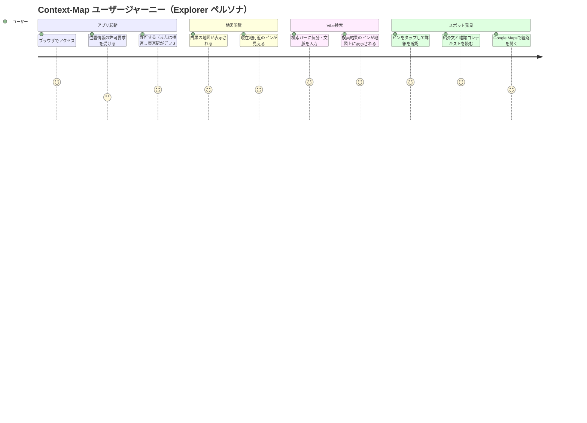
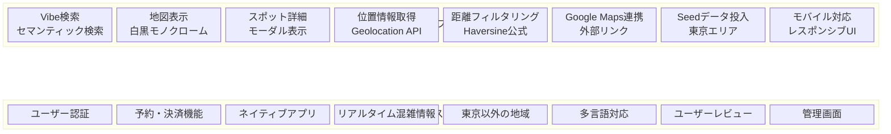

# PRD: Context-Map

| 項目 | 内容 |
|------|------|
| ドキュメントID | PRD-CTXMAP-001 |
| バージョン | 1.0 |
| 作成日 | 2026-02-10 |
| ステータス | Draft |
| 作成者 | PRD Creator |

---

## 1. 概要

### 1.1 プロダクトビジョン

Context-Map は、雑誌のような「文脈（Vibe）」で場所を探せる地図Webアプリケーションである。従来の地図アプリがカテゴリ検索やキーワード検索に依存するのに対し、Context-Map は「静かな場所で本を読みたい」「深夜に一人で考え事」といった自然言語による気分・文脈ベースの検索を提供する。ベクトル類似度検索（Semantic Search）と位置情報を組み合わせ、ユーザーの「今の気分」に合った近くの場所を提案する。

### 1.2 背景と市場機会

2026年現在、AI を活用した「Vibe ベースの場所発見」は急速に注目を集めている。Google Maps も AI によるバイブベースの検索機能を導入し、UC Berkeley の Vibez プロジェクトは感情をインテントとして解釈する旅行体験を構築している。ベクトルデータベース市場は 2024年の21億ドルから2032年には約130億ドルへ成長が予測されており（CAGR 25.5%）、セマンティック検索は「差別化要素」から「当然の期待」へと変化しつつある。

Context-Map は、この潮流の中で以下の差別化を図る:
- **雑誌的キュレーション**: 単なる AI レコメンドではなく、雑誌の特集記事のような文脈（BRUTUS、Hanako 等の特集テーマ）と紐付けたスポット提案
- **ミニマルなUI**: 白黒モノクロームの地図にピンだけが浮かぶ、余白を活かしたデザイン
- **偶然の出会い（Serendipity）の設計**: 効率ではなく「質の高い提案」を重視

### 1.3 ターゲットユーザー

効率性よりも「偶然の出会い」や「質の高い提案」を求める都市生活者。具体的には:

| ペルソナ | 説明 |
|----------|------|
| **Explorer（探索者）** | 新しい場所を見つけることが好き。週末の散歩先や初めてのカフェを探す。20-30代。 |
| **Mood Seeker（気分検索者）** | 「今の気分に合う場所」を求める。目的地ではなく体験を重視する。仕事帰りにふらっと立ち寄る場所が欲しい。 |
| **Culture Curator（文化愛好家）** | 雑誌や SNS で見た世界観に近い場所に実際に行きたい。BRUTUS や Hanako の読者層。 |

---

## 2. ユーザーストーリー

### 2.1 コアストーリー

| ID | ペルソナ | ストーリー | 優先度 |
|----|----------|------------|--------|
| US-001 | Explorer | 週末の午後、地図を開いて「路地裏の古い喫茶店」と入力し、今いる場所の近くにある雰囲気の良い喫茶店を見つけたい。 | Must |
| US-002 | Mood Seeker | 仕事帰りに「深夜に一人で考え事ができる場所」と検索し、自分の気分にフィットするバーやカフェの候補を見つけたい。 | Must |
| US-003 | Culture Curator | 「BRUTUS の読書特集で紹介されそうな場所」というニュアンスで検索し、雑誌的な文脈に沿ったスポットを発見したい。 | Must |
| US-004 | 全ペルソナ | 地図上のピンをタップして、スポットの雰囲気（紹介文）、距離、カテゴリ、雑誌コンテキストを確認したい。 | Must |
| US-005 | 全ペルソナ | 気に入ったスポットの詳細画面から Google Maps を開いて、ナビゲーションを開始したい。 | Must |
| US-006 | 全ペルソナ | 位置情報を許可しなくても、東京駅を基点としてサービスを利用したい。 | Must |

### 2.2 ユーザージャーニー



---

## 3. 機能要件（MVP）

### 3.1 MoSCoW 優先度マトリクス

#### Must Have（MVP必須）

| ID | 機能 | 説明 | 受入基準 |
|----|------|------|----------|
| F-001 | Vibe 検索（セマンティック検索） | 自然言語テキストをベクトル化し、意味的に近いスポットを検索する | AC-001 |
| F-002 | 地図表示 | 白黒モノクロームスタイルの地図を全画面表示する | AC-002 |
| F-003 | スポットピン表示 | 検索結果のスポットを地図上にピンとして表示する | AC-003 |
| F-004 | スポット詳細モーダル | ピンタップ時にスポット名、カテゴリ、距離、紹介文、雑誌コンテキストを表示する | AC-004 |
| F-005 | 位置情報取得 | ブラウザの Geolocation API で現在地を取得する。拒否時は東京駅（35.6812, 139.7671）をデフォルトとする | AC-005 |
| F-006 | 距離フィルタリング | セマンティック検索結果を現在地からの距離でフィルタリング・ソートする | AC-006 |
| F-007 | Google Maps 連携 | スポット詳細から Google Maps を外部リンクで開く | AC-007 |
| F-008 | Seed データ投入 | seed.ts スクリプトで東京のスポットデータ（Embedding付き）を投入する | AC-008 |

#### Should Have（MVP後の優先拡張）

| ID | 機能 | 説明 |
|----|------|------|
| F-101 | PWA 対応 | オフライン表示、ホーム画面追加 |
| F-102 | 検索半径の調整 | ユーザーが検索対象の距離範囲を変更できる |
| F-103 | スポット画像表示 | 詳細モーダルにスポットの写真を表示する |

#### Could Have（将来検討）

| ID | 機能 | 説明 |
|----|------|------|
| F-201 | ブックマーク機能 | お気に入りスポットの保存 |
| F-202 | 対象地域拡大 | 東京以外の都市（大阪、京都等） |
| F-203 | ユーザーレビュー | コミュニティによるスポット評価 |
| F-204 | 多言語対応 | 英語 UI の提供 |

#### Won't Have（本 PRD のスコープ外）

| ID | 機能 | 説明 |
|----|------|------|
| F-301 | ユーザー認証 | ログイン・会員登録機能 |
| F-302 | リアルタイム混雑情報 | 店舗の現在の混雑状況 |
| F-303 | 予約機能 | アプリ内からの店舗予約 |
| F-304 | ネイティブアプリ | iOS / Android ネイティブ版 |

### 3.2 検索アルゴリズム仕様

Vibe 検索のコアロジックは以下のハイブリッド方式で動作する:

1. **テキスト入力**: ユーザーが自然言語で気分・文脈を入力
2. **ベクトル化**: OpenAI text-embedding-3-small（1536次元）でテキストを Embedding に変換
3. **セマンティック検索**: Turso のベクトル拡張（DiskANN インデックス、float32Array カラム）で Cosine Similarity 上位50件を取得
4. **距離フィルタリング**: Haversine 公式で現在地からの距離を算出し、指定半径内（デフォルト3km）のスポットを距離順にソート
5. **結果返却**: フィルタリング後のスポット一覧を地図上に表示

---

## 4. 非機能要件

| カテゴリ | 要件 | 目標値 |
|----------|------|--------|
| パフォーマンス | 検索レスポンス時間（Embedding生成 + ベクトル検索 + フィルタリング） | 2秒以内（P95） |
| パフォーマンス | 地図の初期表示（First Contentful Paint） | 1.5秒以内 |
| パフォーマンス | Largest Contentful Paint (LCP) | 2.5秒以内 |
| 可用性 | サービス稼働率 | 99.5% |
| スケーラビリティ | 初期データ件数（東京エリア） | 100-500件のスポット |
| レスポンシブ | モバイルファースト対応 | iOS Safari / Android Chrome で正常動作 |
| レスポンシブ | デスクトップ対応 | Chrome / Firefox / Safari 最新版 |
| セキュリティ | API キーの保護 | 全ての外部 API キー（OpenAI, Mapbox, Turso）はサーバーサイドのみで使用 |
| セキュリティ | 入力バリデーション | 検索入力のサニタイズ、最大文字数制限（200文字） |
| アクセシビリティ | キーボード操作 | 検索バーへのフォーカス、モーダルの閉じ操作がキーボードで可能 |
| アクセシビリティ | スクリーンリーダー | ARIA ラベルの適切な付与 |

---

## 5. スコープ定義

### 5.1 スコープ境界図



### 5.2 IN スコープ詳細

| 項目 | 説明 |
|------|------|
| Vibe 検索 | 自然言語入力によるセマンティック検索。OpenAI Embedding + Turso ベクトル検索 |
| 地図 UI | Mapbox GL JS による白黒モノクロームスタイルの全画面地図 |
| スポットピン | 検索結果を地図上にピンとして表示。アクセントカラー（群青色系） |
| スポット詳細 | ピンタップで下からスライドインするシートUI。店名、カテゴリ、距離、紹介文、雑誌コンテキスト |
| Google Maps 連携 | 詳細画面から Google Maps へのディープリンク |
| 位置情報 | Geolocation API による現在地取得。拒否時は東京駅をデフォルト |
| 距離フィルタ | 上位50件のセマンティック検索結果を距離でフィルタリング（デフォルト3km圏内） |
| Seed スクリプト | seed.ts による東京エリアのスポットデータ投入（Embedding 事前計算済み） |
| レスポンシブ | モバイルファーストの UI 設計。デスクトップでも利用可能 |

### 5.3 OUT スコープ詳細

| 項目 | 理由 |
|------|------|
| ユーザー認証・会員機能 | MVP では匿名利用を前提とし、開発コストと複雑性を削減 |
| 予約・決済機能 | 外部サービス（Google Maps）への誘導で代替 |
| ネイティブアプリ | Web（PWA前提）で十分な体験を提供。将来の Should Have |
| リアルタイム情報 | 外部データソース連携の複雑性を回避 |
| 東京以外の地域 | MVP では東京に集中し、データ品質とキュレーション精度を担保 |
| 多言語対応 | 初期ターゲットは日本語話者。国際展開は将来検討 |
| ユーザーレビュー・投稿 | キュレーション品質の維持を優先。UGC は将来フェーズ |
| 管理画面（CMS） | 初期データは Seed スクリプトで投入。管理 UI は MVP 後に検討 |

---

## 6. 成功指標

### 6.1 定量指標

| 指標 | 定義 | 目標値 | 測定方法 |
|------|------|--------|----------|
| 検索実行率 | アクセスユーザーのうち検索を実行した割合 | 60%以上 | アナリティクス（検索イベント / セッション数） |
| 検索結果クリック率（CTR） | 検索後にスポットピンをタップした割合 | 40%以上 | アナリティクス（ピンタップイベント / 検索イベント） |
| Google Maps 遷移率 | スポット詳細を開いたユーザーのうち Google Maps リンクをクリックした割合 | 20%以上 | アナリティクス（外部リンククリック / 詳細表示） |
| 検索レスポンスタイム | Vibe 検索の応答時間（P95） | 2秒以内 | サーバーサイドログ |
| 再訪率 | 7日以内にサイトに再訪したユーザーの割合 | 15%以上 | アナリティクス |

### 6.2 定性指標

| 指標 | 定義 | 測定方法 |
|------|------|----------|
| 検索体験の満足度 | 「気分に合った場所が見つかった」と感じるか | ユーザーインタビュー / アンケート（MVP後） |
| UI の世界観 | 「雑誌のような雰囲気」を感じるか | ユーザーテスト / ヒートマップ分析 |
| 発見の質 | 「知らなかった良い場所を見つけた」体験があるか | ユーザーインタビュー |

---

## 7. 受入基準（Acceptance Criteria）

### AC-001: Vibe 検索（セマンティック検索）

```
GIVEN ユーザーが検索バーに自然言語テキストを入力し、検索を実行する
WHEN  テキストが1文字以上200文字以下である
THEN  入力テキストに意味的に関連するスポットが地図上にピンとして表示される
AND   検索結果は最大50件のセマンティック候補から距離フィルタリングされたものである
AND   検索完了までの時間が2秒以内である（P95）
```

### AC-002: 地図表示

```
GIVEN ユーザーがアプリにアクセスする
WHEN  ページが読み込まれる
THEN  画面全体に白黒モノクローム（彩度0）スタイルの地図が表示される
AND   建物は薄いグレーで描画される
AND   地図はドラッグ・ピンチでパン・ズーム操作が可能である
AND   モバイル端末（iOS Safari, Android Chrome）で正常にレンダリングされる
```

### AC-003: スポットピン表示

```
GIVEN 検索が実行され、結果が返却される
WHEN  該当するスポットが1件以上存在する
THEN  各スポットの位置にアクセントカラー（群青色系）のピンが地図上に表示される
AND   地図のビューポートが検索結果のピン群を含む範囲に自動調整される
AND   結果が0件の場合、適切なメッセージ（「該当するスポットが見つかりませんでした」等）が表示される
```

### AC-004: スポット詳細モーダル

```
GIVEN 地図上にスポットのピンが表示されている
WHEN  ユーザーがピンをタップする
THEN  画面下部からスライドインするシートUIが表示される
AND   以下の情報が表示される:
      - スポット名
      - カテゴリ（例: Cafe, Bar）
      - 現在地からの距離（例: 250m away）
      - 紹介文（description）
      - 雑誌コンテキスト（例: "読書特集 2024"）
      - Google Maps で開くボタン
AND   モーダル背景はブラーエフェクトが適用される
AND   ドラッグハンドルまたはモーダル外タップで閉じることができる
```

### AC-005: 位置情報取得

```
GIVEN ユーザーがアプリにアクセスする
WHEN  ブラウザの Geolocation API がサポートされている
THEN  位置情報の許可ダイアログが表示される

GIVEN ユーザーが位置情報を許可する
THEN  現在地が地図の中心として設定される
AND   検索時に現在地の座標が使用される

GIVEN ユーザーが位置情報を拒否する
OR    Geolocation API がサポートされていない
THEN  東京駅の座標（35.6812, 139.7671）がデフォルトとして使用される
AND   地図の中心が東京駅に設定される
AND   ユーザーに位置情報が使用されていない旨の表示は必須ではないが、
      検索は正常に動作する
```

### AC-006: 距離フィルタリング

```
GIVEN セマンティック検索で上位50件の候補が取得されている
WHEN  距離フィルタリングが実行される
THEN  Haversine 公式により各スポットと現在地（またはデフォルト地点）との距離が計算される
AND   デフォルト3km圏内のスポットのみが結果に含まれる
AND   結果は距離の昇順（近い順）でソートされる
```

### AC-007: Google Maps 連携

```
GIVEN スポット詳細モーダルが表示されている
WHEN  ユーザーが「Google Maps で開く」ボタンをタップする
THEN  Google Maps が新しいタブ（またはアプリ）で開かれる
AND   該当スポットの座標が Google Maps に渡される
```

### AC-008: Seed データ投入

```
GIVEN 開発者が seed.ts スクリプトを実行する
WHEN  スクリプトが正常に完了する
THEN  東京エリアのスポットデータが Turso データベースに投入される
AND   各スポットには以下のデータが含まれる:
      - name, lat, lng, category, description, magazine_context
      - OpenAI text-embedding-3-small で事前計算された Embedding（float32Array）
AND   投入後、Vibe 検索が正常に動作する
```

---

## 8. 技術的前提条件

以下はユーザー確認済みの技術決定事項であり、本 PRD の前提条件である。

| 項目 | 決定内容 | 備考 |
|------|----------|------|
| Embedding カラム形式 | float32Array | ネイティブベクトル + DiskANN インデックス |
| Next.js バージョン | 15（安定版） | App Router 使用 |
| データ投入方式 | Seed スクリプト（seed.ts） | 管理画面なし |
| Geolocation 拒否時 | 東京駅をデフォルト | 座標: 35.6812, 139.7671 |
| MVP 対象地域 | 東京 | 他地域は将来拡張 |
| Embedding モデル | OpenAI text-embedding-3-small | 1536次元 |
| 地図エンジン | Mapbox GL JS | モノクローム/ホワイトスタイル |
| データベース | Turso (libSQL) | ベクトル拡張使用 |
| ORM | Drizzle ORM | - |
| CSS | Tailwind CSS | モバイルファースト |

---

## 9. 制約事項

| 制約 | 影響 |
|------|------|
| Turso (SQLite ベース) に PostGIS 相当の地理計算関数がない | 距離計算はアプリケーション層（Haversine 公式）で実施 |
| OpenAI API 呼び出しコスト | 検索ごとに Embedding API を呼び出すため、利用量に応じてコスト増 |
| Seed データの更新 | スクリプト再実行が必要。リアルタイム更新の仕組みは MVP 外 |
| Mapbox 無料枠 | 月間 50,000 マップロードまで無料。超過時は従量課金 |

---

## 10. 用語集

| 用語 | 定義 |
|------|------|
| Vibe 検索 | 自然言語の気分・文脈テキストに基づくセマンティック検索 |
| Embedding | テキストを数値ベクトル（1536次元の浮動小数点配列）に変換したもの |
| Cosine Similarity | 2つのベクトル間の類似度を角度で測定する手法。値が1に近いほど類似 |
| DiskANN | 大規模ベクトルの近似最近傍探索アルゴリズム。ディスクベースで省メモリ |
| Haversine 公式 | 球面上の2点間の最短距離（大圏距離）を計算する公式 |
| セマンティック検索 | キーワードの一致ではなく、意味の類似性に基づいてデータを検索する手法 |
| Seed スクリプト | データベースに初期データを投入するためのスクリプト |
| 雑誌コンテキスト | スポットに紐付けられた雑誌名・特集名情報（例: "BRUTUS 2024/02 読書特集"） |
| Sheet UI | 画面下部からスライドインするモーダルの UI パターン |

---

## 11. 未決定事項

| 項目 | 質問 | 影響範囲 |
|------|------|----------|
| Seed データの件数 | MVP 時点で何件のスポットデータを用意するか（100件? 300件? 500件?） | データ準備工数、検索品質 |
| 検索半径のデフォルト値 | 3km は適切か。東京の都市部では広すぎ/狭すぎの検証が必要 | 検索結果の量と質 |
| アナリティクス導入 | MVP に計測基盤を含めるか、後続フェーズか | 成功指標の測定可否 |

---

## 変更履歴

| バージョン | 日付 | 変更内容 | 変更者 |
|------------|------|----------|--------|
| 1.0 | 2026-02-10 | 初版作成 | PRD Creator |
